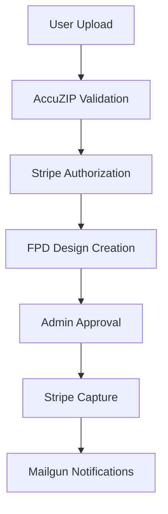

# Yellow Letter Shop - API Integration Software Development Document

## Document Information
- **Version:** 1.0
- **Last Updated:** July 29, 2025
- **Document Type:** Software Development Document (SDD)
- **Project:** Yellow Letter Shop (YLS) SaaS Platform

## 1. Executive Summary

### 1.1 Project Overview
Yellow Letter Shop (YLS) is a direct mail SaaS platform that streamlines the direct mail campaign lifecycle from design and list management to printing, delivery, and analytics. This document serves as the definitive guide for developers to setup and integrate the four critical third-party APIs that power core platform functionality.

**Note:** Complete feature specifications are detailed in `feature-specifications-users.md` and `feature-specifications-admin.md`. Technology stack details are covered in `tech-stack-long.md`.

### 1.2 Integration Priority Matrix

| Priority | API | Core Function | Business Impact |
|----------|-----|---------------|-----------------|
| Critical | AccuZIP | Address validation, mail processing | Revenue-blocking |
| Critical | Stripe | Payment processing | Revenue-blocking |
| High | Mailgun | Transactional emails | User experience |
| High | FPD | Design editor | Core feature |

### 1.3 Integration Dependencies



## 2. AccuZIP API Integration

### 2.1 Purpose
AccuZIP provides address validation, direct mail automation, and mail tracking services critical for determining deliverable record counts and postage eligibility. Integration details for the Mailing List Manager workflow are specified in `feature-specifications-users.md`.

### 2.2 Base Configuration
```typescript
const ACCUZIP_CONFIG = {
  baseUrl: 'https://cloud2.iaccutrace.com',
  apiKey: process.env.ACCUZIP_API_KEY,
  timeout: 30000,
  retryAttempts: 3
};
```

### 2.3 Authentication
All AccuZIP API calls require authentication using the API key in the request body:
```typescript
const requestBody = {
  apiKey: process.env.ACCUZIP_API_KEY,
  // additional parameters
};
```

### 2.4 Core Endpoints

#### 2.4.1 Account Information
- **Endpoint:** `POST /servoy-service/rest_ws/ws_360/v2_0/INFO`
- **Purpose:** Retrieve account details, active status, access level, and remaining/used credits
- **Implementation Priority:** High
- **Request Body:** `{ apiKey: string }`
- **Response:** Account status and credit information

#### 2.4.2 File Upload
- **Endpoint:** `POST /ws_360_webapps/v2_0/uploadProcess.jsp?manual_submit=false`
- **Purpose:** Upload mailing lists for processing
- **File Requirements:**
  - Format: ASCII Text, CSV, TAB, or PIPE-separated with .csv extension
  - Minimum: 200 records plus header row
  - Line termination: CRLF (ASCII 13 ASCII 10)
  - Required columns: `First`, `Address`, `City`
  - Optional columns: `Sal`, `Middle`, `Last`, `Address2`, `St`, `Zip`, `Urban`, `Company`

**EDDM Special Case:**
- File must be named `eddm@.csv`
- Comma-delimited with no header record
- Required columns: 5-Digit ZIP code (low/high), CRRT code (low/high)

**Data Quality Parameters:**
```typescript
const uploadParams = {
  dataQualityResults_CASS: true,
  dataQualityResults_NCOA_DUPS_01: true,
  callbackURL: 'https://yourdomain.com/api/accuzip/callback'
};
```

#### 2.4.3 Processing Workflow Endpoints
The following endpoints must be called in sequence:

**Get Quote:**
- **Endpoint:** `GET /job/<guid>/QUOTE`
- **Purpose:** Returns approximate postage quote and data quality results
- **Error Handling:** Returns "QUOTE is still processing" if not ready

**CASS Certification (Required First):**
- **Endpoint:** `GET /job/<guid>/CASS`
- **Purpose:** Cleans and standardizes all addresses
- **Critical:** Must return `"success":true` before proceeding to other services

**NCOALink Certification:**
- **Endpoint:** `GET /job/<guid>/NCOA`
- **Purpose:** Processes Change of Address matching
- **Prerequisite:** Requires fully executed Processing Acknowledgment Form (PAF)
- **Dependency:** Only call after CASS returns success

**Duplicate Detection:**
- **Endpoint:** `GET /job/<guid>/DUPS/<duplicateSubType>`
- **Purpose:** Removes duplicate records
- **Sub-types:** 
  - `01`: Address Only and Company
  - `02`: First and Last name
  - `03`: Household name
- **Optional:** User can mail to 100% of list if desired

**Update Quote:**
- **Endpoint:** `PUT /job/<guid>/QUOTE`
- **Purpose:** Update quote objects (Class of Mail, Piece Size)
- **Critical:** Must be called before Presort service
- **EDDM Requirements:** `presort_class` must be `"STANDARD MAIL (EDDM)"`, `mail_piece_size` either `"LETTER"` or `"FLAT"`

**Presort Processing:**
- **Endpoint:** `GET /job/<guid>/PRESORT`
- **Purpose:** Processes addresses through Cloud Presort engine for lowest postage rates
- **Supports:** First-Class and Standard Mail Letters and Flats

#### 2.4.4 All-in-One Processing
- **Endpoint:** `GET /job/<guid>/CASS-NCOA-DUPS-PRESORT`
- **Purpose:** Performs all processing steps in single asynchronous call
- **Returns:** Control immediately, uses callback URL when complete
- **Alternative:** Use GET QUOTE to check status if callback not supported

#### 2.4.5 File Downloads
**Print-Ready CSV:**
- **Endpoint:** `GET /download.jsp?guid=<guid>&ftype=csv`
- **Preview:** Use `prev.csv` to download first 25 records

**USPS Documentation:**
- **Endpoint:** `GET /download.jsp?guid=<guid>&ftype=pdf`
- **Contents:** Bookmarked PDF with Mailing Statement, Qualification Report, CASS Certificate, NCOALink Certificate, Presort Summary
- **Mail.dat:** Available as `maildat.zip` for PostalOne! eDoc

#### 2.4.6 PostalOne! Integration
- **Endpoint:** `POST /job/<guid>/POSTALONE`
- **Purpose:** Upload, Update, Cancel, and Delete Full-Service Mail.dat jobs
- **Prerequisites:** 
  - UPDATE QUOTE must be called first
  - Requires `p1_env`, `p1_usr`, `p1_psw`, `p1_action`, `mailing_date`
  - Unique `maildat_jobid` (max 8-bytes, alphanumeric)

#### 2.4.7 Data Retrieval Endpoints
**Retrieve Duplicates:**
- **Endpoint:** `GET /job/<guid>/DUPLICATES/<duplicateSubType>`

**Retrieve NCOALink Records:**
- **Endpoint:** `GET /job/<guid>/MoveUpdate/<filterSubType>`

**Retrieve CASS Records:**
- **Endpoint:** `GET /job/<guid>/CleanAddresses/<filterSubType>`

**Replace All Data:**
- **Endpoint:** `PUT /job/<guid>`
- **Purpose:** Write back modified records before final presorting

### 2.5 Integration Points
**Detailed workflows and business logic are specified in `feature-specifications-users.md`. Key integration points include:**
- Mailing List Manager pre-checkout validation
- Dynamic postage type filtering based on deliverable count
- Mail Tracking service integration via AccuTrace

### 2.6 Error Handling Strategy
```typescript
const accuzipErrorHandler = {
  'QUOTE is still processing': 'retry_after_delay',
  'Insufficient credits': 'notify_admin',
  'Invalid file format': 'user_feedback_required',
  'Network timeout': 'retry_with_backoff',
  'CASS processing failed': 'abort_workflow'
};
```

### 2.7 Webhook Implementation
```typescript
// Callback URL handler for AccuZIP job completion
app.post('/api/accuzip/callback', async (req, res) => {
  const { guid, status } = req.query;
  
  // Update job status in database
  await supabase
    .from('accuzip_jobs')
    .update({ status: status })
    .eq('job_guid', guid);
  
  // Trigger next workflow step
  if (status === 'completed') {
    await processCompletedJob(guid);
  }
  
  res.status(200).send('OK');
});
```

## 3. Stripe API Integration

### 3.1 Purpose
Primary payment processor handling authorization, capture, refunds, and subscription management. Detailed payment workflows are specified in `feature-specifications-users.md` and pricing rules in `pricing-specifications-long.md`.

### 3.2 Base Configuration
```typescript
const STRIPE_CONFIG = {
  baseUrl: 'https://api.stripe.com',
  secretKey: process.env.STRIPE_SECRET_KEY,
  publishableKey: process.env.STRIPE_PUBLISHABLE_KEY,
  webhookSecret: process.env.STRIPE_WEBHOOK_SECRET,
  apiVersion: '2023-10-16'
};
```

### 3.3 Authentication
- **Method:** HTTP Basic Auth
- **Username:** 'api'
- **Password:** Secret API key
- **Headers:** `Authorization: Bearer <secret_key>`
- **Client-side:** Use publishable key with Stripe.js

### 3.4 Core Implementation Patterns

#### 3.4.1 Payment Intent Creation (Authorization)
```typescript
const createPaymentIntent = async (orderData) => {
  const paymentIntent = await stripe.paymentIntents.create({
    amount: orderData.totalAmount, // in cents
    currency: 'usd',
    capture_method: 'manual', // Critical: Manual capture only
    metadata: {
      orderId: orderData.id,
      userId: orderData.userId
    },
    automatic_payment_methods: {
      enabled: true
    }
  });
  
  return paymentIntent;
};
```

#### 3.4.2 Manual Capture After Design Approval
```typescript
const capturePayment = async (paymentIntentId) => {
  try {
    const capturedPayment = await stripe.paymentIntents.capture(paymentIntentId);
    
    // Update order status in database
    await supabase
      .from('orders')
      .update({ 
        payment_status: 'captured',
        captured_at: new Date().toISOString()
      })
      .eq('stripe_payment_intent_id', paymentIntentId);
    
    return capturedPayment;
  } catch (error) {
    // Handle capture failure
    console.error('Payment capture failed:', error);
    throw error;
  }
};
```

#### 3.4.3 Webhook Handling
```typescript
const handleStripeWebhook = async (req, res) => {
  const sig = req.headers['stripe-signature'];
  let event;

  try {
    event = stripe.webhooks.constructEvent(req.body, sig, STRIPE_CONFIG.webhookSecret);
  } catch (err) {
    console.log(`Webhook signature verification failed.`, err.message);
    return res.status(400).send(`Webhook Error: ${err.message}`);
  }

  switch (event.type) {
    case 'payment_intent.succeeded':
      await handlePaymentSuccess(event.data.object);
      break;
    case 'payment_intent.payment_failed':
      await handlePaymentFailure(event.data.object);
      break;
    case 'payment_intent.canceled':
      await handlePaymentCancellation(event.data.object);
      break;
    default:
      console.log(`Unhandled event type ${event.type}`);
  }

  res.json({received: true});
};
```

#### 3.4.4 Refund Processing
```typescript
const processRefund = async (paymentIntentId, amount = null) => {
  try {
    const refund = await stripe.refunds.create({
      payment_intent: paymentIntentId,
      amount: amount, // null for full refund
      reason: 'requested_by_customer'
    });
    
    // Log refund in activity logs
    await logActivity({
      action: 'refund_processed',
      payment_intent_id: paymentIntentId,
      refund_id: refund.id,
      amount: refund.amount
    });
    
    return refund;
  } catch (error) {
    console.error('Refund processing failed:', error);
    throw error;
  }
};
```

### 3.5 Critical Webhook Events
- **payment_intent.succeeded:** Update order status to paid
- **payment_intent.payment_failed:** Handle failed payments, notify user
- **payment_intent.canceled:** Clean up abandoned orders
- **charge.dispute.created:** Handle chargebacks

### 3.6 Security Requirements
- Never expose secret keys in frontend code
- Verify webhook signatures using `stripe.webhooks.constructEvent()`
- Use Stripe.js for client-side tokenization
- Implement proper error handling for all API calls
- Log all payment events for audit trail

### 3.7 Error Handling
```typescript
const stripeErrorHandler = (error) => {
  switch (error.type) {
    case 'StripeCardError':
      return { message: 'Your card was declined.' };
    case 'StripeRateLimitError':
      return { message: 'Too many requests, please try again later.' };
    case 'StripeInvalidRequestError':
      return { message: 'Invalid parameters.' };
    case 'StripeAPIError':
      return { message: 'Internal server error, please try again.' };
    case 'StripeConnectionError':
      return { message: 'Network error, please check your connection.' };
    case 'StripeAuthenticationError':
      return { message: 'Authentication error.' };
    default:
      return { message: 'An unknown error occurred.' };
  }
};
```

## 4. Mailgun API Integration

### 4.1 Purpose
Transactional email delivery for user notifications throughout campaign lifecycle. Email types and triggers are detailed in `feature-specifications-users.md` and `feature-specifications-admin.md`.

### 4.2 Base Configuration
```typescript
const MAILGUN_CONFIG = {
  baseUrl: 'https://api.mailgun.net', // US region
  // Use 'https://api.eu.mailgun.net' for EU region
  apiKey: process.env.MAILGUN_API_KEY,
  domain: process.env.MAILGUN_DOMAIN,
  fromAddress: 'noreply@yellowlettershop.com'
};
```

### 4.3 Authentication
- **Method:** HTTP Basic Auth
- **Username:** 'api'
- **Password:** Mailgun API key
- **Encoding:** Base64 encode `api:${apiKey}`

### 4.4 Core Email Templates
```typescript
const emailTemplates = {
  LIST_UPLOAD_SUCCESS: {
    subject: 'Mailing List Upload Complete',
    template: 'list-upload-confirmation'
  },
  PROOF_READY: {
    subject: 'Your Design Proof is Ready',
    template: 'design-proof-ready'
  },
  ORDER_SHIPPED: {
    subject: 'Your Order Has Been Shipped',
    template: 'order-shipped-notification'
  },
  CAMPAIGN_REJECTED: {
    subject: 'Campaign Requires Revision',
    template: 'campaign-moderation-rejection'
  },
  POSTAGE_INELIGIBLE: {
    subject: 'Postage Type Changed',
    template: 'postage-type-changed'
  }
};
```

### 4.5 Email Sending Implementation
```typescript
const sendTransactionalEmail = async (templateType, recipient, templateData) => {
  const template = emailTemplates[templateType];
  
  const formData = new FormData();
  formData.append('from', MAILGUN_CONFIG.fromAddress);
  formData.append('to', recipient);
  formData.append('subject', template.subject);
  formData.append('template', template.template);
  
  // Add template variables
  Object.keys(templateData).forEach(key => {
    formData.append(`v:${key}`, templateData[key]);
  });

  try {
    const response = await fetch(`${MAILGUN_CONFIG.baseUrl}/v3/${MAILGUN_CONFIG.domain}/messages`, {
      method: 'POST',
      headers: {
        'Authorization': `Basic ${Buffer.from(`api:${MAILGUN_CONFIG.apiKey}`).toString('base64')}`
      },
      body: formData
    });

    if (!response.ok) {
      throw new Error(`Mailgun API error: ${response.status}`);
    }

    const result = await response.json();
    
    // Log email for audit trail
    await logEmailActivity({
      template_type: templateType,
      recipient: recipient,
      message_id: result.id,
      status: 'sent'
    });

    return result;
  } catch (error) {
    console.error('Email sending failed:', error);
    throw error;
  }
};
```

### 4.6 Template Variables
Common variables used across email templates:
```typescript
const commonTemplateVars = {
  user_name: 'First name of the user',
  campaign_name: 'Name of the campaign',
  order_id: 'Order identifier',
  tracking_number: 'Shipping tracking number',
  rejection_reason: 'Reason for campaign rejection',
  support_email: 'Support contact email',
  dashboard_url: 'Link to user dashboard'
};
```

### 4.7 Webhook Handling (Optional)
```typescript
const handleMailgunWebhook = async (req, res) => {
  const { signature, token, timestamp } = req.body;
  
  // Verify webhook signature
  const crypto = require('crypto');
  const hash = crypto.createHmac('sha256', MAILGUN_CONFIG.webhookSigningKey)
                   .update(timestamp + token)
                   .digest('hex');
  
  if (hash !== signature) {
    return res.status(401).send('Unauthorized');
  }

  const { event, message } = req.body['event-data'];
  
  // Handle different email events
  switch (event) {
    case 'delivered':
      await updateEmailStatus(message.headers['message-id'], 'delivered');
      break;
    case 'failed':
      await updateEmailStatus(message.headers['message-id'], 'failed');
      break;
    case 'complained':
      await handleSpamComplaint(message.recipient);
      break;
  }

  res.status(200).send('OK');
};
```

### 4.8 Error Handling
```typescript
const mailgunErrorHandler = (error, templateType, recipient) => {
  const errorLog = {
    template_type: templateType,
    recipient: recipient,
    error_message: error.message,
    timestamp: new Date().toISOString()
  };

  // Log error for debugging
  console.error('Mailgun error:', errorLog);
  
  // Retry logic for transient errors
  if (error.message.includes('rate limit') || error.status === 502) {
    // Implement retry with exponential backoff
    return 'retry';
  }
  
  // For permanent failures, log and continue
  return 'skip';
};
```

## 5. Fancy Product Designer (FPD) Integration

### 5.1 Purpose
Embedded WYSIWYG canvas editor for mail piece design with drag-and-drop functionality and variable data merge. Design workflows are detailed in `feature-specifications-users.md`.

### 5.2 Frontend Integration Setup
```typescript
// Initialize FPD instance
const initializeFPD = (containerId, options = {}) => {
  const fpd = new FancyProductDesigner(document.getElementById(containerId), {
    editorMode: true,
    stageWidth: 800,
    stageHeight: 600,
    ...options
  });
  
  return fpd;
};
```

### 5.3 Loading FPD Library
```html
<!-- Include FPD CSS and JS files -->
<link rel="stylesheet" href="https://fancyproductdesigner.com/css/FancyProductDesigner-all.min.css">
<script src="https://fancyproductdesigner.com/js/FancyProductDesigner-all.min.js"></script>
```

### 5.4 Core Implementation Patterns

#### 5.4.1 Designer Initialization
```typescript
const setupDesigner = async (productData = null) => {
  const fpd = initializeFPD('fpd-container');
  
  // Wait for designer to be ready
  fpd.addEventListener('ready', () => {
    console.log('FPD is ready');
    
    // Load existing product or template
    if (productData) {
      fpd.loadProduct(productData);
    } else {
      // Load default template
      loadDefaultTemplate(fpd);
    }
  });

  // Handle design changes
  fpd.addEventListener('productCreate', (evt) => {
    console.log('Product created');
    saveDesignDraft(evt.detail);
  });

  return fpd;
};
```

#### 5.4.2 Variable Tag Implementation
```typescript
const variableTags = {
  '{{FirstName}}': 'recipient.first_name',
  '{{LastName}}': 'recipient.last_name',
  '{{FullName}}': 'recipient.full_name',
  '{{PropertyAddress}}': 'recipient.property_address',
  '{{City}}': 'recipient.city',
  '{{State}}': 'recipient.state',
  '{{ZipCode}}': 'recipient.zip_code',
  '{{CompanyName}}': 'sender.company_name',
  '{{ReturnAddress}}': 'sender.return_address'
};

// Add variable tag to design
const addVariableTag = (fpd, tagName, position) => {
  fpd.currentViewInstance.addElement('text', tagName, {
    left: position.x,
    top: position.y,
    fontSize: 16,
    fontFamily: 'Arial',
    fill: '#000000',
    editable: true
  });
};
```

#### 5.4.3 Design Preview with Sample Data
```typescript
const previewWithSampleData = (fpd, sampleRecord) => {
  // Get current design data
  const designData = fpd.getProduct();
  
  // Replace variable tags with sample data
  const previewData = replaceVariableTags(designData, sampleRecord);
  
  // Create preview instance
  const previewFpd = initializeFPD('preview-container', {
    editorMode: false // Read-only mode
  });
  
  previewFpd.addEventListener('ready', () => {
    previewFpd.loadProduct(previewData);
  });
  
  return previewFpd;
};

const replaceVariableTags = (designData, sampleRecord) => {
  const updatedData = JSON.parse(JSON.stringify(designData));
  
  // Recursively replace tags in text elements
  const replaceTags = (obj) => {
    for (let key in obj) {
      if (typeof obj[key] === 'string') {
        Object.keys(variableTags).forEach(tag => {
          const fieldPath = variableTags[tag];
          const value = getNestedValue(sampleRecord, fieldPath) || tag;
          obj[key] = obj[key].replace(new RegExp(tag, 'g'), value);
        });
      } else if (typeof obj[key] === 'object' && obj[key] !== null) {
        replaceTags(obj[key]);
      }
    }
  };
  
  replaceTags(updatedData);
  return updatedData;
};
```

#### 5.4.4 Design Validation and Export
```typescript
const validateDesign = (fpd) => {
  const designData = fpd.getProduct();
  const errors = [];
  
  // Check for required elements
  if (!hasRequiredElements(designData)) {
    errors.push('Design must include recipient address');
  }
  
  // Check for variable tags
  const unusedTags = findUnusedVariableTags(designData);
  if (unusedTags.length > 0) {
    errors.push(`Unused variable tags: ${unusedTags.join(', ')}`);
  }
  
  return {
    isValid: errors.length === 0,
    errors: errors
  };
};

const exportDesign = async (fpd, format = 'json') => {
  switch (format) {
    case 'json':
      return fpd.getProduct();
    case 'pdf':
      return await fpd.exportAsPDF();
    case 'image':
      return await fpd.exportAsImage('png');
    default:
      throw new Error(`Unsupported export format: ${format}`);
  }
};
```

### 5.5 Admin Preview Integration
```typescript
// Render design for admin moderation (read-only)
const renderAdminPreview = (fpdJsonData, containerId) => {
  const previewFpd = initializeFPD(containerId, {
    editorMode: false,
    enableEditing: false
  });
  
  previewFpd.addEventListener('ready', () => {
    previewFpd.loadProduct(fpdJsonData);
    
    // Disable all interactions
    previewFpd.currentViewInstance.canvas.selection = false;
    previewFpd.currentViewInstance.canvas.forEachObject((obj) => {
      obj.selectable = false;
      obj.evented = false;
    });
  });
  
  return previewFpd;
};
```

### 5.6 Template Management
```typescript
const templateManager = {
  save: async (designData, templateName, category) => {
    const template = {
      name: templateName,
      category: category,
      design_data: designData,
      variable_tags: extractVariableTags(designData),
      preview_image: await generatePreviewImage(designData)
    };
    
    return await supabase
      .from('templates')
      .insert(template);
  },
  
  load: async (templateId) => {
    const { data } = await supabase
      .from('templates')
      .select('*')
      .eq('id', templateId)
      .single();
    
    return data;
  },
  
  list: async (category = null) => {
    let query = supabase
      .from('templates')
      .select('*')
      .order('created_at', { ascending: false });
    
    if (category) {
      query = query.eq('category', category);
    }
    
    const { data } = await query;
    return data;
  }
};
```

### 5.7 Error Handling
```typescript
const fpdErrorHandler = {
  handleLoadError: (error) => {
    console.error('FPD load error:', error);
    // Show user-friendly error message
    showErrorMessage('Failed to load design. Please try again.');
  },
  
  handleSaveError: (error) => {
    console.error('FPD save error:', error);
    // Auto-retry save operation
    setTimeout(() => {
      attemptAutoSave();
    }, 5000);
  },
  
  handleExportError: (error) => {
    console.error('FPD export error:', error);
    // Offer alternative export options
    showExportAlternatives();
  }
};
```

## 6. Implementation Guidelines

### 6.1 Development Phases
**Complete development timeline is detailed in `product-roadmap-long.md`. Critical API integration phases:**

#### Phase 1: Core Infrastructure (Week 1-2)
1. Set up Next.js API routes for each integration
2. Configure environment variables and secrets management
3. Implement basic authentication for each API
4. Create database schema updates for API data storage

#### Phase 2: AccuZIP Integration (Week 3-4)
1. Implement file upload and validation workflow
2. Build processing status monitoring with webhooks
3. Create quote retrieval and display logic
4. Integrate with order processing system

#### Phase 3: Stripe Integration (Week 5-6)
1. Implement authorization/capture payment flow
2. Build comprehensive webhook handling system
3. Create admin refund processing interface
4. Add subscription management features

#### Phase 4: Supporting Services (Week 7-8)
1. Integrate Mailgun email notification system
2. Implement FPD design editor with variable tags
3. Build admin preview functionality
4. Add comprehensive error handling and logging

### 6.2 Database Schema Requirements

#### 6.2.1 New Tables
```sql
-- API integration logs
CREATE TABLE api_logs (
  id UUID PRIMARY KEY DEFAULT gen_random_uuid(),
  api_name VARCHAR(50) NOT NULL,
  endpoint VARCHAR(255) NOT NULL,
  request_data JSONB,
  response_data JSONB,
  status_code INTEGER,
  duration_ms INTEGER,
  created_at TIMESTAMP DEFAULT NOW()
);

-- AccuZIP job tracking
CREATE TABLE accuzip_jobs (
  id UUID PRIMARY KEY DEFAULT gen_random_uuid(),
  order_id UUID REFERENCES orders(id),
  job_guid VARCHAR(255) UNIQUE NOT NULL,
  status VARCHAR(50) DEFAULT 'pending',
  deliverable_count INTEGER,
  upload_filename VARCHAR(255),
  callback_received_at TIMESTAMP,
  created_at TIMESTAMP DEFAULT NOW()
);

-- Email activity logs
CREATE TABLE email_logs (
  id UUID PRIMARY KEY DEFAULT gen_random_uuid(),
  template_type VARCHAR(100) NOT NULL,
  recipient VARCHAR(255) NOT NULL,
  message_id VARCHAR(255),
  status VARCHAR(50) DEFAULT 'sent',
  error_message TEXT,
  created_at TIMESTAMP DEFAULT NOW()
);

-- Design templates
CREATE TABLE templates (
  id UUID PRIMARY KEY DEFAULT gen_random_uuid(),
  name VARCHAR(255) NOT NULL,
  category VARCHAR(100),
  design_data JSONB NOT NULL,
  variable_tags TEXT[],
  preview_image_url TEXT,
  is_public BOOLEAN DEFAULT false,
  created_by UUID REFERENCES profiles(id),
  created_at TIMESTAMP DEFAULT NOW()
);
```

#### 6.2.2 Existing Table Updates
```sql
-- Add API-related fields to orders table
ALTER TABLE orders 
ADD COLUMN stripe_payment_intent_id VARCHAR(255),
ADD COLUMN accuzip_job_guid VARCHAR(255),
ADD COLUMN fpd_design_data JSONB,
ADD COLUMN mail_tracking_enabled BOOLEAN DEFAULT false;

-- Add indexes for performance
CREATE INDEX idx_orders_stripe_payment_intent ON orders(stripe_payment_intent_id);
CREATE INDEX idx_orders_accuzip_guid ON orders(accuzip_job_guid);
CREATE INDEX idx_accuzip_jobs_guid ON accuzip_jobs(job_guid);
```

## 7. Security and Compliance

### 7.1 API Key Management
- Store all API keys in environment variables
- Use AWS Systems Manager Parameter Store for production
- Implement key rotation procedures
- Never log API keys or sensitive payment data
- Use different keys for test and production environments

### 7.2 Access Control
**Detailed security requirements are specified in `feature-specifications-admin.md`. Key API security measures:**
- Implement Role-Based Access Control (RBAC) via Supabase RLS
- Validate all input data before making API calls
- Use request signing for webhook verification
- Implement rate limiting for API endpoints

### 7.3 Data Protection
- Encrypt sensitive data at rest in database
- Use HTTPS for all API communications
- Implement comprehensive request/response logging (excluding sensitive data)
- Set up monitoring for suspicious API activity
- Comply with PCI DSS requirements for payment data

## 8. Testing Strategy

### 8.1 Unit Testing (Jest)
```typescript
describe('AccuZIP Integration', () => {
  test('should validate mailing list successfully', async () => {
    const mockResponse = { success: true, deliverable_count: 500 };
    jest.spyOn(global, 'fetch').mockResolvedValue({
      ok: true,
      json: () => Promise.resolve(mockResponse)
    });

    const result = await validateMailingList(mockListData);
    expect(result.deliverable_count).toBe(500);
  });
  
  test('should handle insufficient credit error', async () => {
    const mockError = { error: 'Insufficient credits' };
    jest.spyOn(global, 'fetch').mockResolvedValue({
      ok: false,
      json: () => Promise.resolve(mockError)
    });

    await expect(validateMailingList(mockListData))
      .rejects.toThrow('Insufficient credits');
  });
});

describe('Stripe Integration', () => {
  test('should create payment intent with manual capture', async () => {
    const mockPaymentIntent = {
      id: 'pi_test_123',
      capture_method: 'manual',
      status: 'requires_payment_method'
    };
    
    stripe.paymentIntents.create.mockResolvedValue(mockPaymentIntent);
    
    const result = await createPaymentIntent(orderData);
    expect(result.capture_method).toBe('manual');
  });
});
```

### 8.2 Integration Testing
- Test complete API workflows end-to-end
- Verify webhook handling with test payloads from each service
- Test error scenarios and recovery mechanisms
- Validate data consistency across all integrated systems

### 8.3 End-to-End Testing (Cypress)
```typescript
describe('Order Processing with API Integration', () => {
  it('should complete full order workflow', () => {
    cy.visit('/orders/create');
    
    // Upload mailing list
    cy.get('[data-testid="file-upload"]').selectFile('test-mailing-list.csv');
    cy.wait('@accuzipValidation');
    
    // Verify postage options filtered by count
    cy.get('[data-testid="postage-selector"]').should('contain', 'First Class');
    cy.get('[data-testid="postage-selector"]').should('not.contain', 'Standard Class');
    
    // Complete design and approve
    cy.get('[data-testid="design-approval"]').click();
    cy.get('[data-testid="confirm-design"]').click();
    
    // Verify payment capture
    cy.wait('@stripeCapture');
    cy.get('[data-testid="order-status"]').should('contain', 'Payment Captured');
  });
});
```

## 9. Monitoring and Maintenance

### 9.1 Health Checks
```typescript
const healthChecks = {
  accuzip: async () => {
    try {
      const response = await fetch(`${ACCUZIP_CONFIG.baseUrl}/servoy-service/rest_ws/ws_360/v2_0/INFO`, {
        method: 'POST',
        headers: { 'Content-Type': 'application/json' },
        body: JSON.stringify({ apiKey: ACCUZIP_CONFIG.apiKey })
      });
      return response.ok;
    } catch (error) {
      return false;
    }
  },
  
  stripe: async () => {
    try {
      await stripe.balance.retrieve();
      return true;
    } catch (error) {
      return false;
    }
  },
  
  mailgun: async () => {
    try {
      const response = await fetch(`${MAILGUN_CONFIG.baseUrl}/v3/domains/${MAILGUN_CONFIG.domain}`, {
        headers: {
          'Authorization': `Basic ${Buffer.from(`api:${MAILGUN_CONFIG.apiKey}`).toString('base64')}`
        }
      });
      return response.ok;
    } catch (error) {
      return false;
    }
  }
};
```

### 9.2 Performance Monitoring
- Monitor API response times for each service
- Track success/failure rates with alerting thresholds
- Set up dashboards for API health metrics
- Implement automatic retry mechanisms with exponential backoff
- Monitor webhook delivery success rates

### 9.3 Error Logging and Alerting
```typescript
const apiLogger = {
  logRequest: async (api, endpoint, requestData, responseData, duration, statusCode) => {
    await supabase.from('api_logs').insert({
      api_name: api,
      endpoint: endpoint,
      request_data: sanitizeLogData(requestData),
      response_data: sanitizeLogData(responseData),
      duration_ms: duration,
      status_code: statusCode
    });
  },
  
  alertOnFailure: async (api, error) => {
    if (shouldAlert(api, error)) {
      await sendSlackAlert({
        api: api,
        error: error.message,
        timestamp: new Date().toISOString()
      });
    }
  }
};
```

## 10. Deployment Considerations

### 10.1 Environment Configuration
```bash
# Production environment variables
ACCUZIP_API_KEY=live_accuzip_key_here
STRIPE_SECRET_KEY=sk_live_...
STRIPE_PUBLISHABLE_KEY=pk_live_...
STRIPE_WEBHOOK_SECRET=whsec_...
MAILGUN_API_KEY=mailgun_live_key
MAILGUN_DOMAIN=mg.yourdomain.com
FPD_LICENSE_KEY=fpd_production_license
```

### 10.2 Deployment Pipeline
- Validate all API keys are properly configured
- Run health checks against all integrated services
- Deploy to staging environment first
- Test critical workflows in staging
- Monitor error rates and performance metrics post-deployment

### 10.3 Rollback Strategy
- Maintain previous API integration versions
- Implement feature flags for new API integrations
- Have database migration rollback scripts ready
- Monitor critical business metrics for regression detection

## 11. Support and Maintenance

### 11.1 API Support Contacts
- **AccuZIP:** api@accuzip.com (free unlimited email support)
- **Stripe:** Standard Stripe support channels and documentation
- **Mailgun:** Mailgun support documentation and help center
- **FPD:** Fancy Product Designer documentation and support forums

### 11.2 Documentation Maintenance
- Keep API integration runbooks updated
- Document troubleshooting procedures for common issues
- Maintain integration flow diagrams
- Keep change logs for all API updates and version changes

---

**Document Approval:**
- Technical Lead: _________________
- Product Manager: _________________
- DevOps Lead: _________________

**Next Review Date:** August 29, 2025