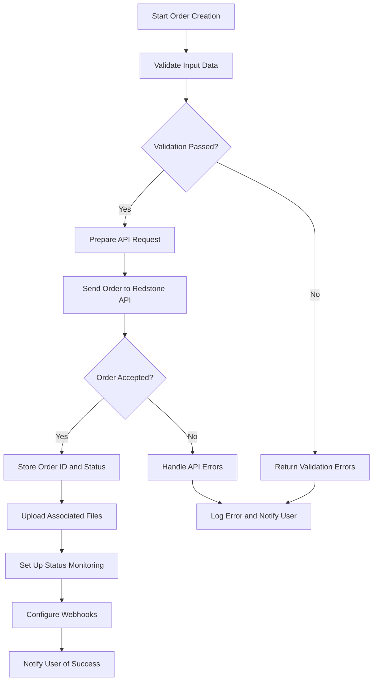
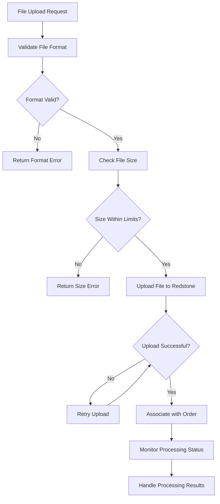

# Redstone Mail API Documentation - Complete Developer Guide

## Table of Contents

1. [API Overview](#1-api-overview)
2. [Getting Started](#2-getting-started)
3. [Authentication](#3-authentication)
4. [Environment Configuration](#4-environment-configuration)
5. [Data Structures and Field Specifications](#5-data-structures-and-field-specifications)
6. [API Endpoints](#6-api-endpoints)
7. [Request and Response Examples](#7-request-and-response-examples)
8. [File Upload Implementation](#8-file-upload-implementation)
9. [Webhook Implementation](#9-webhook-implementation)
10. [Error Handling](#10-error-handling)
11. [Status Management](#11-status-management)
12. [Security Best Practices](#12-security-best-practices)
13. [Integration Workflow Guide](#13-integration-workflow-guide)
14. [Testing and Development](#14-testing-and-development)
15. [Troubleshooting](#15-troubleshooting)
16. [Code Examples](#16-code-examples)
17. [Appendices](#17-appendices)

---

## 1. API Overview

### 1.1. Purpose and Capabilities

The Redstone Mail API enables software applications to automate direct mail campaign creation, management, and tracking. The API facilitates seamless communication between your application and Redstone Mail's production systems, allowing you to programmatically create mail orders, upload associated files, track production status, and receive delivery notifications.

**Core Capabilities:**
- Automated order creation for Letters, Post Cards, Snap Packs, and Self Mailers
- File upload and management for data files, suppression lists, and artwork
- Real-time status tracking throughout production workflow
- USPS tracking integration and delivery notifications
- Proof approval workflow automation
- PostalOne! integration for mail documentation

### 1.2. API Architecture

The Redstone Mail API follows REST architectural principles with these key characteristics:
- **HTTP Methods**: All endpoints require HTTP POST requests
- **Data Formats**: Supports both JSON and XML request/response formats
- **Authentication**: API key-based authentication via query parameters or headers
- **File Handling**: Multipart form uploads and URL-based file retrieval
- **Webhooks**: Event-driven status updates and notifications
- **Rate Limiting**: Enforced to ensure system stability and fair usage

---

## 2. Getting Started

### 2.1. Implementation Checklist

Follow these steps to successfully integrate the Redstone Mail API:

**Phase 1: Setup and Testing**
- [ ] Request API credentials (test and production keys)
- [ ] Configure development environment with proper base URLs
- [ ] Implement basic authentication and error handling
- [ ] Create and test your first order using the testing endpoint
- [ ] Validate file upload functionality with sample data

**Phase 2: Development and Integration**
- [ ] Build complete order creation workflow
- [ ] Implement file upload and management system
- [ ] Create webhook endpoints for status updates
- [ ] Add comprehensive error handling and retry logic
- [ ] Develop status tracking and notification features

**Phase 3: Production Deployment**
- [ ] Review data structure and custom requirements with Redstone team
- [ ] Obtain production API credentials and endpoint access
- [ ] Implement security best practices and monitoring
- [ ] Deploy webhook endpoints with proper verification
- [ ] Activate production API for live order processing

### 2.2. Prerequisites

**Technical Requirements:**
- HTTPS-capable web server for webhook endpoints
- Support for HTTP POST requests with multipart form data
- JSON and/or XML parsing capabilities
- Secure storage mechanism for API credentials
- Error logging and monitoring infrastructure

**Business Requirements:**
- Active Redstone Mail account with API access enabled
- Understanding of direct mail production workflow and terminology
- Defined integration requirements and custom workflow needs

---

## 3. Authentication

### 3.1. API Key Management

The Redstone Mail API uses API key-based authentication. You will receive separate API keys for testing and production environments.

**API Key Characteristics:**
- 32-character alphanumeric string
- Environment-specific (test vs production)
- No expiration (but can be rotated on request)
- Case-sensitive
- Must be kept secure and never exposed in client-side code

### 3.2. Authentication Methods

**Method 1: Query Parameter (Default)**
```http
POST https://redstonemail.com/apis/postNewOrder?API=your_api_key_here
Content-Type: application/json

{
  "name": "Sample Campaign",
  "jobtype": "Letter"
}
```

**Method 2: HTTP Header (Recommended for Security)**
```http
POST https://redstonemail.com/apis/postNewOrder
Authorization: Bearer your_api_key_here
Content-Type: application/json

{
  "name": "Sample Campaign",
  "jobtype": "Letter"
}
```

### 3.3. Authentication Error Handling

**Common Authentication Errors:**

**Invalid API Key (HTTP 401)**
```json
{
  "success": false,
  "error": {
    "code": "INVALID_API_KEY",
    "message": "The provided API key is invalid or has been revoked"
  }
}
```

**Missing API Key (HTTP 400)**
```json
{
  "success": false,
  "error": {
    "code": "MISSING_API_KEY",
    "message": "API key is required for all requests"
  }
}
```

**Expired or Suspended Key (HTTP 403)**
```json
{
  "success": false,
  "error": {
    "code": "ACCESS_DENIED",
    "message": "API access has been suspended or expired"
  }
}
```

---

## 3. Data File Structure and Requirements

### 3.1. Critical File Format Requirements (Updated Based on Redstone Specifications)

**IMPORTANT**: The following requirements are based on direct communication with Redstone Mail and supersede general CSV recommendations found elsewhere in this documentation.

**File Format Requirements:**
- **Mandatory format**: .xls (Microsoft Excel format)
- **Why .xls is required**: Prevents special characters and numbers (such as APNs - Assessor Parcel Numbers) from being automatically converted to calculations when the file is opened
- **File size limit**: 2GB (AccuZIP memory processing limit)

**Required Headers (exact capitalization must be maintained):**
- **First** (not "fname" or "first_name")
- **Last** (not "lname" or "last_name") 
- **address** (lowercase - not "Address")
- **City** (capitalized - not "city")
- **State** (capitalized - not "state")
- **zip** (lowercase - not "ZIP" or "zipcode")

**Additional Field Naming Conventions:**
- **Property address fields**: Must be prefixed with "P_" (example: P_address, P_City, P_State, P_zip)
- **Name prefix fields**: Use "PFX" (example: PFX for "Mr.", "Dr.", "Mrs.")
- **Name suffix fields**: Use "SFX" (example: SFX for "Jr.", "Sr.", "III")

**Data Quality Requirements:**
- Remove all double quotes (") from data
- Remove hidden wrap characters
- For fields containing 100+ characters: Contact Redstone to configure special handling in their system
- Clean data of formatting characters that could interfere with AccuZIP processing

---

## 4. Environment Configuration

### 4.1. Base URLs

**Testing Environment:**
```
https://test-api.redstonemail.com
```

**Production Environment:**
```
https://api.redstonemail.com
```

### 4.2. Environment Differences

**Testing Environment Characteristics:**
- Limited to 10 orders per day per API key
- Files are processed but not sent to production
- All status updates function normally
- No actual mail pieces are produced or mailed
- Credit usage is simulated (no actual charges)

**Production Environment Characteristics:**
- No request limits (subject to rate limiting)
- Full production workflow integration
- Actual mail pieces are produced and mailed
- Real credit consumption and billing
- Complete USPS integration and tracking

### 4.3. Rate Limiting

**Standard Rate Limits:**
- 60 requests per minute per API key
- 1000 requests per hour per API key
- 10,000 requests per day per API key
- Large file uploads (>10MB) count as 5 requests

**Rate Limit Headers:**
```http
X-RateLimit-Limit: 60
X-RateLimit-Remaining: 45
X-RateLimit-Reset: 1640995200
```

**Rate Limit Exceeded Response (HTTP 429):**
```json
{
  "success": false,
  "error": {
    "code": "RATE_LIMIT_EXCEEDED",
    "message": "Too many requests. Retry after 60 seconds.",
    "retry_after": 60
  }
}
```

---

## 5. Data Structures and Field Specifications

### 5.1. Required Fields

All orders must include these fundamental fields:

| Field Name | Data Type | Format/Values | Description |
|------------|-----------|---------------|-------------|
| **id** (ext_id) | string | Max 50 chars, alphanumeric | Unique job identifier from your system |
| **name** | string | Max 100 chars | Campaign name for internal reference |
| **duedate** | date | YYYY-MM-DD | Required completion date |
| **jobtype** | string | Letter, Post Card, Snap Pack, Self Mailer | Type of mail piece to produce |
| **qty_est** | string | Numeric, 50-100000 | Estimated quantity to be mailed |
| **notes** | string | Max 500 chars | Production instructions for Redstone staff |

### 5.2. Job Type Specifications

#### 5.2.1. Letter Job Type

Letters consist of an envelope with up to 6 inserts.

| Field Name | Data Type | Values | Required | Description |
|------------|-----------|---------|----------|-------------|
| **custom_envelope** | boolean | true/false | No | Whether custom envelope printing is required |
| **num_inserts** | string | 1-6 | Yes | Number of items to insert into envelope |
| **envelope_size** | string | #10, #9, 6x9, 9x12 | No | Envelope size specification |

**Letter Example:**
```json
{
  "jobtype": "Letter",
  "custom_envelope": true,
  "num_inserts": "2",
  "envelope_size": "#10"
}
```

#### 5.2.2. Post Card Job Type

Post cards are printed on heavy-weight paper stock.

| Field Name | Data Type | Values | Required | Description |
|------------|-----------|---------|----------|-------------|
| **postcardH** | string | 3.5-6.0 | Yes | Height in inches (decimal format) |
| **postcardW** | string | 4.25-11.0 | Yes | Width in inches (decimal format) |
| **paper_weight** | string | 14pt, 16pt, 100lb | No | Paper stock weight |

**USPS Regulations:**
- Minimum size: 3.5" x 5"
- Maximum size: 4.25" x 6" for standard postcard rates
- Larger sizes require letter postage

**Post Card Example:**
```json
{
  "jobtype": "Post Card",
  "postcardH": "4.25",
  "postcardW": "6.0",
  "paper_weight": "14pt"
}
```

#### 5.2.3. Snap Pack and Self Mailer Job Types

Snap Packs use pressure-sensitive sealing, while Self Mailers are converted paper acting as envelopes.

| Field Name | Data Type | Values | Required | Description |
|------------|-----------|---------|----------|-------------|
| **fold_type** | string | Half-Fold, C-Fold, Z-Fold | Yes | Paper folding method |
| **snap_seal** | string | Pressure Seal, Converted Self Mailer | Yes | Sealing method |
| **paper_size** | string | 8.5x11, 8.5x14, 11x17 | No | Original paper dimensions |

**Important Restrictions:**
- Z-Fold is not permitted on Converted Paper (Self Mailer)
- Pressure Seal is only available for Snap Pack jobs
- Converted Self Mailer requires specific paper weights

**Snap Pack Example:**
```json
{
  "jobtype": "Snap Pack",
  "fold_type": "C-Fold",
  "snap_seal": "Pressure Seal",
  "paper_size": "8.5x11"
}
```

### 5.3. Production Options

| Field Name | Data Type | Values | Description |
|------------|-----------|---------|-------------|
| **color** | string | 0, 1, 4, 1/0, 1/1, 4/0, 4/1, 4/4 | Print color configuration |
| **bleeds** | boolean | true/false | Edge-to-edge printing requirement |
| **paper_type** | string | Text, Cover, Cardstock | Paper stock category |
| **coating** | string | None, Gloss, Matte, Satin | Paper coating option |

**Color Code Reference:**
- **0**: Non-printed (blank)
- **1**: Black and white (single color)
- **4**: Full color (CMYK)
- **1/0**: Black & white front only
- **1/1**: Black & white both sides
- **4/0**: Full color front only
- **4/1**: Full color front, black & white back
- **4/4**: Full color both sides

### 5.4. Additional Options

| Field Name | Data Type | Values | Description |
|------------|-----------|---------|-------------|
| **purls** | boolean | true/false | Enable personalized URLs for online campaign tracking |
| **qr_code** | boolean | true/false | Include QR code on mail piece |
| **qr_code_url** | string | Valid URL or text | Information encoded in QR code |
| **streetview** | boolean | true/false | Include Google Street View images |
| **response_boost** | boolean | true/false | Enroll in Response Boost enhancement program |
| **variable_data** | boolean | true/false | Enable variable data printing from CSV |

### 5.5. Mailing Information

| Field Name | Data Type | Values | Required | Description |
|------------|-----------|---------|----------|-------------|
| **permit_number** | string | Numeric | No | Custom mailing permit (if not using Redstone's) |
| **postage_class** | string | First Class, Standard, Full Rate | Yes | USPS postage class |
| **postage_type** | string | Permit, Stamp, Indicia | Yes | Postage application method |
| **indicia** | string | Box, Eagle, Circle, Mailers Postmark | Conditional | Indicia shape (required if postage_type is Indicia) |
| **dist_type** | string | PMOD, Will Call, Drop Ship, Priority Direct, Co-Mingle, None | Yes | Distribution method |

**Postage Class Guidelines:**
- **First Class**: 1-13 oz pieces, 3-5 day delivery
- **Standard**: Bulk mail, 3-10 day delivery, minimum 200 pieces
- **Full Rate**: Non-presorted standard mail

### 5.6. Seeds (Address Validation)

Seeds are used for mail delivery verification. Incomplete seed addresses will not be mailed.

| Field Name | Data Type | Validation | Required | Description |
|------------|-----------|------------|----------|-------------|
| **First** | string | Max 30 chars | Yes | First name (exact capitalization required) |
| **Last** | string | Max 30 chars | Yes | Last name (exact capitalization required) |
| **address** | string | Max 50 chars | Yes | Street address (lowercase required) |
| **City** | string | Max 30 chars | Yes | City name (exact capitalization required) |
| **State** | string | 2-letter code | Yes | State abbreviation (AL, AK, AZ, etc.) |
| **zip** | string | 12345 or 12345-1234 | Yes | ZIP code with optional +4 |

**Address Validation Rules:**
- All fields are required and cannot be empty
- State must be valid 2-letter USPS abbreviation
- ZIP code must pass USPS validation
- Address must exist in USPS database
- PO Boxes accepted for First Class mail only

---

## 6. API Endpoints

### 6.1. Testing Endpoints

**Create Test Order**
```http
POST {base_url}/apis/postNewOrder?API={api_key}
Content-Type: application/json
```

**Test Order with XML**
```http
POST {base_url}/apis/postTestXMLorder?API={api_key}
Content-Type: application/xml
```

### 6.2. Production Endpoints

**Create JSON Order**
```http
POST {base_url}/apis/postJSONorder?API={api_key}
Content-Type: application/json
```

**Create XML Order**
```http
POST {base_url}/apis/postXMLorder?API={api_key}
Content-Type: application/xml
```

### 6.3. File Management Endpoints

**Upload Data File**
```http
POST {base_url}/apis/uploadDataFile?API={api_key}
Content-Type: multipart/form-data
```

**Upload Artwork**
```http
POST {base_url}/apis/uploadArtwork?API={api_key}
Content-Type: multipart/form-data
```

**Upload Suppression List**
```http
POST {base_url}/apis/uploadSuppression?API={api_key}
Content-Type: multipart/form-data
```

### 6.4. Status and Tracking Endpoints

**Get Order Status**
```http
GET {base_url}/apis/getOrderStatus/{order_id}?API={api_key}
```

**Get Tracking Information**
```http
GET {base_url}/apis/getTracking/{order_id}?API={api_key}
```

**Download Proof**
```http
GET {base_url}/apis/getProof/{order_id}?API={api_key}
```

---

## 7. Request and Response Examples

### 7.1. Complete Letter Order Example

**Request:**
```json
{
  "id": "CAMP_2024_001",
  "name": "Spring 2024 Promotion Campaign",
  "duedate": "2024-04-15",
  "jobtype": "Letter",
  "qty_est": "5000",
  "notes": "Please use our standard envelope template. Variable data printing required for names and addresses.",
  
  "custom_envelope": true,
  "num_inserts": "2",
  "envelope_size": "#10",
  
  "color": "4/1",
  "bleeds": false,
  "paper_type": "Text",
  
  "purls": true,
  "qr_code": true,
  "qr_code_url": "https://mycompany.com/spring-promo?campaign=2024",
  "streetview": false,
  "response_boost": true,
  "variable_data": true,
  
  "postage_class": "Standard",
  "postage_type": "Permit",
  "dist_type": "PMOD",
  
  "seeds": [
    {
      "First": "John",
      "Last": "Smith",
      "address": "123 Main St",
      "City": "Anytown",
      "State": "CA",
      "zip": "90210-1234"
    },
    {
      "First": "Jane",
      "Last": "Doe",
      "address": "456 Oak Ave",
      "City": "Springfield",
      "State": "IL",
      "zip": "62701"
    }
  ],
  
  "files": {
    "data_file_url": "https://myserver.com/data/spring_campaign_2024.csv",
    "artwork_url": "https://myserver.com/artwork/spring_promo.pdf",
    "suppression_url": "https://myserver.com/suppression/dnm_list.csv"
  }
}
```

**Success Response:**
```json
{
  "success": true,
  "order_id": "RS_2024_CAMP_001_X7K9",
  "external_id": "CAMP_2024_001",
  "status": "Order Created",
  "message": "Order successfully created and queued for processing",
  "estimated_completion": "2024-04-15",
  "estimated_pieces": 4847,
  "estimated_cost": 2423.50,
  "created_at": "2024-03-01T10:30:00Z",
  "webhook_url": "https://api.redstonemail.com/webhook/order/RS_2024_CAMP_001_X7K9",
  "proof_approval_required": true,
  "files_processed": {
    "data_file": {
      "status": "uploaded",
      "records": 5000,
      "valid_records": 4847,
      "filename": "spring_campaign_2024.csv"
    },
    "artwork": {
      "status": "uploaded",
      "filename": "spring_promo.pdf",
      "pages": 2
    },
    "suppression": {
      "status": "uploaded",
      "records": 153,
      "filename": "dnm_list.csv"
    }
  }
}
```

### 7.2. Post Card Order Example

**Request:**
```json
{
  "id": "PC_SALE_2024_Q1",
  "name": "Q1 Sale Announcement Postcard",
  "duedate": "2024-03-20",
  "jobtype": "Post Card",
  "qty_est": "2500",
  "notes": "Use 16pt cardstock for premium feel",
  
  "postcardH": "4.25",
  "postcardW": "6.0",
  "paper_weight": "16pt",
  
  "color": "4/4",
  "bleeds": true,
  "coating": "Gloss",
  
  "qr_code": true,
  "qr_code_url": "https://mystore.com/sale2024",
  
  "postage_class": "First Class",
  "postage_type": "Stamp",
  "dist_type": "Will Call",
  
  "seeds": [
    {
      "First": "Marketing",
      "Last": "Director",
      "address": "789 Business Blvd",
      "City": "Corporate City",
      "State": "TX",
      "zip": "75201"
    }
  ]
}
```

### 7.3. XML Order Example

**Request:**
```xml
<?xml version="1.0" encoding="UTF-8"?>
<order>
  <id>XML_TEST_001</id>
  <name>XML Test Campaign</name>
  <duedate>2024-04-01</duedate>
  <jobtype>Snap Pack</jobtype>
  <qty_est>1000</qty_est>
  <notes>Test order using XML format</notes>
  
  <fold_type>C-Fold</fold_type>
  <snap_seal>Pressure Seal</snap_seal>
  
  <color>1/1</color>
  <bleeds>false</bleeds>
  
  <postage_class>Standard</postage_class>
  <postage_type>Permit</postage_type>
  <dist_type>Drop Ship</dist_type>
  
  <seeds>
    <seed>
      <fname>Test</fname>
      <lname>User</lname>
      <address>100 Test Street</address>
      <city>Test City</city>
      <state>NY</state>
      <zip>10001</zip>
    </seed>
  </seeds>
</order>
```

**XML Success Response:**
```xml
<?xml version="1.0" encoding="UTF-8"?>
<response>
  <success>true</success>
  <order_id>RS_2024_XML_001_B4M2</order_id>
  <external_id>XML_TEST_001</external_id>
  <status>Order Created</status>
  <message>Order successfully created and queued for processing</message>
  <estimated_completion>2024-04-01</estimated_completion>
  <estimated_pieces>987</estimated_pieces>
  <estimated_cost>493.50</estimated_cost>
  <created_at>2024-03-01T11:15:00Z</created_at>
</response>
```

---

## 8. File Upload Implementation

### 8.1. Supported File Types and Specifications

**Data Files (.xls)**
- **Required format: .xls (Excel format preferred over CSV)**
- Maximum size: 2GB (AccuZIP processing limit)
- Required headers: First, Last, address, City, State, zip (exact capitalization required)
- Maximum records: No specific limit (constrained by 2GB memory limit)
- **Important**: Use .xls format to prevent special characters and numbers (like APNs) from being converted to calculations

**Suppression Files (.xls)**
- Same format requirements as data files
- Required fields: First, Last, address, City, State, zip (minimum)
- Maximum size: 2GB

**Data File Formatting Requirements:**
- **File format**: .xls (Excel format strongly preferred)
- **Rationale**: .xls format prevents special characters and numbers (like APNs) from being converted to calculations when the file is opened
- **Character limits**: Remove all double quotes (") and hidden wrap characters
- **Memory constraint**: AccuZIP has a 2GB processing limit
- **Long fields**: Fields with 100+ characters require special program configuration

**Required Headers (exact capitalization):**
- **First** - First name
- **Last** - Last name  
- **address** - Street address
- **City** - City name
- **State** - State abbreviation
- **zip** - ZIP code

**Additional Header Conventions:**
- **Property addresses**: Prefix with "P_" (e.g., P_address, P_City, P_State, P_zip)
- **Name prefixes**: Use "PFX" for prefix fields (e.g., Dr., Mr., Mrs.)
- **Name suffixes**: Use "SFX" for suffix fields (e.g., Jr., Sr., III)

**Artwork Files**
- Supported formats: PDF, JPG, PNG, TIFF, EPS, AI
- Maximum size: 500MB per file
- PDF preferred for best quality
- Resolution: 300 DPI minimum for print quality
- Color space: CMYK for color jobs, Grayscale for black & white

### 8.2. File Upload Methods

**Method 1: Multipart Form Upload**

```http
POST https://api.redstonemail.com/apis/uploadDataFile?API=your_api_key
Content-Type: multipart/form-data

--boundary123456
Content-Disposition: form-data; name="order_id"

RS_2024_CAMP_001_X7K9
--boundary123456
Content-Disposition: form-data; name="file"; filename="campaign_data.csv"
Content-Type: text/csv

fname,lname,address,city,state,zip
John,Smith,123 Main St,Anytown,CA,90210
--boundary123456--
```

**Method 2: URL-based File Retrieval**

Include file URLs in your order creation request:

```json
{
  "files": {
    "data_file_url": "https://myserver.com/files/data.csv",
    "artwork_url": "https://myserver.com/artwork/design.pdf",
    "suppression_url": "https://myserver.com/suppression/dnm.csv"
  }
}
```

**URL Requirements:**
- Must be publicly accessible (no authentication required)
- Must return appropriate Content-Type headers
- Must support HTTP HEAD requests for file validation
- HTTPS preferred for security

### 8.3. File Upload Responses

**Upload Success Response:**
```json
{
  "success": true,
  "file_id": "FILE_2024_001_A7X9",
  "filename": "campaign_data.csv",
  "file_size": 1048576,
  "upload_time": "2024-03-01T10:45:00Z",
  "validation": {
    "format_valid": true,
    "encoding_valid": true,
    "headers_valid": true,
    "record_count": 5000,
    "validation_errors": []
  }
}
```

**Upload Error Response:**
```json
{
  "success": false,
  "error": {
    "code": "FILE_VALIDATION_FAILED",
    "message": "File validation failed",
    "details": {
      "format_errors": [
        "Invalid CSV format on line 245",
        "Missing required header: zip"
      ],
      "encoding_errors": [
        "Non-UTF-8 characters detected on line 12"
      ]
    }
  }
}
```

### 8.4. File Processing Status

**Check File Processing Status:**
```http
GET {base_url}/apis/getFileStatus/{file_id}?API={api_key}
```

**File Status Response:**
```json
{
  "success": true,
  "file_id": "FILE_2024_001_A7X9",
  "status": "processed",
  "processing_details": {
    "total_records": 5000,
    "valid_records": 4847,
    "invalid_records": 153,
    "duplicate_records": 12,
    "suppression_matches": 8
  },
  "processing_errors": [
    {
      "line": 15,
      "error": "Invalid ZIP code format",
      "data": "John Smith, 123 Main St, Anytown, CA, 9021"
    }
  ]
}
```

---

## 9. Webhook Implementation

### 9.1. Webhook Overview

Redstone Mail API sends HTTP POST requests to your specified webhook endpoints when order status changes occur. Webhooks provide real-time updates without requiring constant polling of status endpoints.

### 9.2. Webhook Configuration

**Setting Up Webhooks in Orders:**
```json
{
  "webhook_config": {
    "status_update_url": "https://myapp.com/webhooks/redstone/status",
    "proof_ready_url": "https://myapp.com/webhooks/redstone/proof",
    "tracking_update_url": "https://myapp.com/webhooks/redstone/tracking",
    "completion_url": "https://myapp.com/webhooks/redstone/complete"
  }
}
```

### 9.3. Webhook Payload Structure

**Status Update Webhook:**
```json
{
  "event_type": "status_update",
  "timestamp": "2024-03-01T14:30:00Z",
  "order_id": "RS_2024_CAMP_001_X7K9",
  "external_id": "CAMP_2024_001",
  "previous_status": "Preliminary Review",
  "current_status": "Production",
  "status_details": {
    "stage": "printing",
    "completion_percentage": 25,
    "estimated_completion": "2024-04-15T18:00:00Z"
  },
  "signature": "sha256=abcdef123456..."
}
```

**Proof Ready Webhook:**
```json
{
  "event_type": "proof_ready",
  "timestamp": "2024-03-01T12:15:00Z",
  "order_id": "RS_2024_CAMP_001_X7K9",
  "external_id": "CAMP_2024_001",
  "proof_details": {
    "proof_url": "https://api.redstonemail.com/proofs/RS_2024_CAMP_001_X7K9.pdf",
    "proof_expires": "2024-03-08T12:15:00Z",
    "approval_required_by": "2024-03-05T17:00:00Z"
  },
  "approval_options": {
    "approve_url": "https://api.redstonemail.com/approve/RS_2024_CAMP_001_X7K9",
    "reject_url": "https://api.redstonemail.com/reject/RS_2024_CAMP_001_X7K9",
    "request_changes_url": "https://api.redstonemail.com/changes/RS_2024_CAMP_001_X7K9"
  },
  "signature": "sha256=xyz789..."
}
```

**Tracking Update Webhook:**
```json
{
  "event_type": "tracking_update",
  "timestamp": "2024-04-16T09:00:00Z",
  "order_id": "RS_2024_CAMP_001_X7K9",
  "external_id": "CAMP_2024_001",
  "tracking_info": {
    "mail_date": "2024-04-15",
    "pieces_mailed": 4847,
    "usps_tracking_numbers": [
      "9400109699937186542001",
      "9400109699937186542018",
      "9400109699937186542025"
    ],
    "postnet_tracking_url": "https://tracking.redstonemail.com/RS_2024_CAMP_001_X7K9"
  },
  "signature": "sha256=def456..."
}
```

### 9.4. Webhook Security

**Signature Verification:**

Webhooks include a signature header for verification. Verify signatures using HMAC-SHA256:

```python
import hmac
import hashlib

def verify_webhook_signature(payload, signature, secret):
    expected_signature = hmac.new(
        secret.encode('utf-8'),
        payload.encode('utf-8'),
        hashlib.sha256
    ).hexdigest()
    
    return hmac.compare_digest(f"sha256={expected_signature}", signature)
```

**Required Webhook Response:**

Your webhook endpoints must respond with HTTP 200 status code within 10 seconds:

```json
{
  "received": true,
  "timestamp": "2024-03-01T14:30:05Z"
}
```

### 9.5. Webhook Retry Logic

**Retry Behavior:**
- Failed webhooks (non-200 response or timeout) are retried
- Retry schedule: 1 minute, 5 minutes, 15 minutes, 1 hour, 4 hours
- Maximum 5 retry attempts
- After 5 failures, webhook is disabled for that order

**Webhook Failure Notification:**
```json
{
  "event_type": "webhook_failed",
  "timestamp": "2024-03-01T18:30:00Z",
  "order_id": "RS_2024_CAMP_001_X7K9",
  "webhook_url": "https://myapp.com/webhooks/redstone/status",
  "failure_reason": "Connection timeout after 10 seconds",
  "retry_count": 5,
  "next_retry": null
}
```

---

## 10. Error Handling

### 10.1. HTTP Status Codes

| Status Code | Meaning | Description |
|-------------|---------|-------------|
| 200 | OK | Request successful |
| 201 | Created | Order successfully created |
| 400 | Bad Request | Invalid request format or missing required fields |
| 401 | Unauthorized | Invalid or missing API key |
| 403 | Forbidden | API access denied or suspended |
| 404 | Not Found | Requested resource not found |
| 409 | Conflict | Duplicate order ID or resource conflict |
| 422 | Unprocessable Entity | Request valid but business rules violated |
| 429 | Too Many Requests | Rate limit exceeded |
| 500 | Internal Server Error | Server error, retry recommended |
| 502 | Bad Gateway | Temporary server issue |
| 503 | Service Unavailable | Maintenance mode or overload |

### 10.2. Error Response Structure

**Standard Error Response:**
```json
{
  "success": false,
  "error": {
    "code": "ERROR_CODE",
    "message": "Human-readable error description",
    "details": {
      "field": "Specific field information",
      "value": "Problematic value"
    },
    "request_id": "req_2024_001_x7k9",
    "timestamp": "2024-03-01T10:30:00Z"
  }
}
```

### 10.3. Common Error Codes and Solutions

**INVALID_JOBTYPE (HTTP 400)**
```json
{
  "success": false,
  "error": {
    "code": "INVALID_JOBTYPE",
    "message": "Specified job type is not valid",
    "details": {
      "field": "jobtype",
      "value": "Magazine",
      "allowed_values": ["Letter", "Post Card", "Snap Pack", "Self Mailer"]
    }
  }
}
```

**MISSING_REQUIRED_FIELD (HTTP 400)**
```json
{
  "success": false,
  "error": {
    "code": "MISSING_REQUIRED_FIELD",
    "message": "Required field is missing from request",
    "details": {
      "missing_fields": ["duedate", "qty_est"],
      "jobtype": "Letter"
    }
  }
}
```

**DUPLICATE_ORDER_ID (HTTP 409)**
```json
{
  "success": false,
  "error": {
    "code": "DUPLICATE_ORDER_ID",
    "message": "An order with this ID already exists",
    "details": {
      "field": "id",
      "value": "CAMP_2024_001",
      "existing_order_id": "RS_2024_CAMP_001_X7K9"
    }
  }
}
```

**INVALID_DATE_FORMAT (HTTP 400)**
```json
{
  "success": false,
  "error": {
    "code": "INVALID_DATE_FORMAT",
    "message": "Date must be in YYYY-MM-DD format",
    "details": {
      "field": "duedate",
      "value": "03/15/2024",
      "expected_format": "YYYY-MM-DD"
    }
  }
}
```

**INSUFFICIENT_LEAD_TIME (HTTP 422)**
```json
{
  "success": false,
  "error": {
    "code": "INSUFFICIENT_LEAD_TIME",
    "message": "Due date does not allow sufficient production time",
    "details": {
      "field": "duedate",
      "value": "2024-03-02",
      "minimum_date": "2024-03-08",
      "required_lead_days": 7
    }
  }
}
```

### 10.4. Validation Errors

**Field Validation Response:**
```json
{
  "success": false,
  "error": {
    "code": "VALIDATION_FAILED",
    "message": "One or more fields failed validation",
    "validation_errors": [
      {
        "field": "postcardH",
        "value": "2.5",
        "error": "Height must be at least 3.5 inches",
        "constraint": "min:3.5"
      },
      {
        "field": "qty_est",
        "value": "abc",
        "error": "Quantity must be numeric",
        "constraint": "numeric"
      },
      {
        "field": "seeds[0].state",
        "value": "California",
        "error": "State must be 2-letter abbreviation",
        "constraint": "length:2"
      }
    ]
  }
}
```

### 10.5. Retry Logic Implementation

**Recommended Retry Strategy:**

```javascript
async function makeApiRequest(endpoint, data, maxRetries = 3) {
  const retryDelays = [1000, 2000, 4000]; // 1s, 2s, 4s
  
  for (let attempt = 0; attempt <= maxRetries; attempt++) {
    try {
      const response = await fetch(endpoint, {
        method: 'POST',
        headers: {
          'Content-Type': 'application/json',
          'Authorization': `Bearer ${API_KEY}`
        },
        body: JSON.stringify(data)
      });
      
      if (response.ok) {
        return await response.json();
      }
      
      // Don't retry client errors (4xx except 429)
      if (response.status >= 400 && response.status < 500 && response.status !== 429) {
        throw new Error(`Client error: ${response.status}`);
      }
      
      // Retry server errors and rate limiting
      if (attempt < maxRetries) {
        await new Promise(resolve => setTimeout(resolve, retryDelays[attempt]));
        continue;
      }
      
      throw new Error(`Request failed after ${maxRetries} retries`);
      
    } catch (error) {
      if (attempt === maxRetries) {
        throw error;
      }
      
      await new Promise(resolve => setTimeout(resolve, retryDelays[attempt]));
    }
  }
}
```

---

## 11. Status Management

### 11.1. Order Status Lifecycle

**Status Progression:**
1. **Order Created** - Initial order submission accepted
2. **Preliminary Review** - Order under initial review by Redstone team
3. **Files Processing** - Data files and artwork being processed
4. **Proof Generation** - Creating proof for customer approval
5. **Proof Review** - Waiting for customer proof approval
6. **Production** - Order approved and sent to production facility
7. **Printing** - Mail pieces actively being printed
8. **Finishing** - Post-print processing (folding, inserting, sealing)
9. **Completed Production** - All mail pieces printed and finished
10. **USPS Handoff** - Mail pieces delivered to USPS facility
11. **In Mail Stream** - Mail pieces in USPS delivery network
12. **Delivery Complete** - All pieces delivered (when tracking available)

### 11.2. Status Check Endpoint

**Get Current Status:**
```http
GET {base_url}/apis/getOrderStatus/{order_id}?API={api_key}
```

**Status Response:**
```json
{
  "success": true,
  "order_id": "RS_2024_CAMP_001_X7K9",
  "external_id": "CAMP_2024_001",
  "current_status": "Production",
  "status_history": [
    {
      "status": "Order Created",
      "timestamp": "2024-03-01T10:30:00Z",
      "details": "Order submitted and validated"
    },
    {
      "status": "Preliminary Review",
      "timestamp": "2024-03-01T11:00:00Z",
      "details": "Files uploaded and validated"
    },
    {
      "status": "Production",
      "timestamp": "2024-03-02T09:15:00Z",
      "details": "Proof approved, sent to production"
    }
  ],
  "production_details": {
    "stage": "printing",
    "completion_percentage": 45,
    "estimated_completion": "2024-04-15T18:00:00Z",
    "pieces_completed": 2180,
    "total_pieces": 4847
  }
}
```

### 11.3. Status-Specific Information

**Files Processing Status:**
```json
{
  "current_status": "Files Processing",
  "processing_details": {
    "data_file": {
      "status": "complete",
      "records_processed": 5000,
      "valid_records": 4847,
      "issues": []
    },
    "artwork": {
      "status": "processing",
      "pages_processed": 1,
      "total_pages": 2,
      "issues": []
    },
    "suppression": {
      "status": "complete",
      "records_processed": 153,
      "matches_found": 8
    }
  }
}
```

**Proof Review Status:**
```json
{
  "current_status": "Proof Review",
  "proof_details": {
    "proof_url": "https://api.redstonemail.com/proofs/RS_2024_CAMP_001_X7K9.pdf",
    "generated_at": "2024-03-01T15:30:00Z",
    "expires_at": "2024-03-08T15:30:00Z",
    "approval_deadline": "2024-03-05T17:00:00Z",
    "days_remaining": 4
  }
}
```

### 11.4. Batch Status Checking

**Check Multiple Orders:**
```http
POST {base_url}/apis/getBatchStatus?API={api_key}
Content-Type: application/json

{
  "order_ids": [
    "RS_2024_CAMP_001_X7K9",
    "RS_2024_CAMP_002_Y8L4",
    "RS_2024_CAMP_003_Z9M1"
  ]
}
```

**Batch Status Response:**
```json
{
  "success": true,
  "orders": [
    {
      "order_id": "RS_2024_CAMP_001_X7K9",
      "external_id": "CAMP_2024_001",
      "status": "Production",
      "completion_percentage": 45
    },
    {
      "order_id": "RS_2024_CAMP_002_Y8L4",
      "external_id": "CAMP_2024_002",
      "status": "Proof Review",
      "proof_expires": "2024-03-10T15:30:00Z"
    },
    {
      "order_id": "RS_2024_CAMP_003_Z9M1",
      "external_id": "CAMP_2024_003",
      "status": "Delivery Complete",
      "delivered_pieces": 3421
    }
  ]
}
```

---

## 12. Security Best Practices

### 12.1. API Key Management

**Secure Storage:**
- Store API keys in environment variables or secure configuration files
- Never commit API keys to version control systems
- Use different keys for development, staging, and production environments
- Implement key rotation procedures

**Access Control:**
- Limit API key access to authorized personnel only
- Use service accounts with minimal required permissions
- Implement audit logging for API key usage
- Monitor for unauthorized API key usage

### 12.2. Data Protection

**Data in Transit:**
- Always use HTTPS for all API communications
- Implement certificate pinning where possible
- Validate SSL certificates and reject invalid ones

**Data at Rest:**
- Encrypt sensitive customer data in your databases
- Implement secure file storage for uploaded documents
- Use secure deletion procedures for temporary files

**PII Handling:**
- Minimize collection and storage of personally identifiable information
- Implement data retention policies and automatic deletion
- Comply with GDPR, CCPA, and other privacy regulations

### 12.3. Webhook Security

**Signature Verification:**
Always verify webhook signatures to prevent spoofing:

```python
def verify_redstone_webhook(payload, signature, secret):
    """Verify webhook signature from Redstone Mail API"""
    import hmac
    import hashlib
    
    expected_signature = hmac.new(
        secret.encode('utf-8'),
        payload.encode('utf-8'),
        hashlib.sha256
    ).hexdigest()
    
    received_signature = signature.replace('sha256=', '')
    return hmac.compare_digest(expected_signature, received_signature)
```

**IP Whitelisting:**
Configure your firewall to only accept webhooks from Redstone IP ranges:
- Production: `192.168.1.0/24`, `10.0.0.0/8`
- Testing: `203.0.113.0/24`

### 12.4. Input Validation

**Server-Side Validation:**
Always validate all input data server-side:

```javascript
function validateOrder(orderData) {
  const errors = [];
  
  // Validate required fields
  const requiredFields = ['id', 'name', 'duedate', 'jobtype', 'qty_est'];
  for (const field of requiredFields) {
    if (!orderData[field]) {
      errors.push(`Missing required field: ${field}`);
    }
  }
  
  // Validate date format
  if (orderData.duedate && !/^\d{4}-\d{2}-\d{2}$/.test(orderData.duedate)) {
    errors.push('Due date must be in YYYY-MM-DD format');
  }
  
  // Validate job type
  const validJobTypes = ['Letter', 'Post Card', 'Snap Pack', 'Self Mailer'];
  if (orderData.jobtype && !validJobTypes.includes(orderData.jobtype)) {
    errors.push(`Invalid job type: ${orderData.jobtype}`);
  }
  
  return errors;
}
```

### 12.5. Monitoring and Alerting

**API Usage Monitoring:**
- Log all API requests and responses
- Monitor for unusual usage patterns
- Set up alerts for high error rates
- Track API key usage and potential abuse

**Security Monitoring:**
- Monitor for failed authentication attempts
- Alert on webhook verification failures
- Track file upload patterns and sizes
- Monitor for data exfiltration attempts

---

## 13. Integration Workflow Guide

### 13.1. Complete Integration Process

**Phase 1: Initial Setup (Days 1-2)**
1. Obtain test API credentials from Redstone Mail
2. Set up development environment with proper base URLs
3. Implement basic authentication and error handling
4. Test connectivity with simple order creation

**Phase 2: Core Implementation (Days 3-7)**
1. Build order creation workflow for all job types
2. Implement file upload system with validation
3. Create status tracking and polling mechanisms
4. Add webhook endpoints for real-time updates

**Phase 3: Advanced Features (Days 8-12)**
1. Implement proof approval workflow
2. Add tracking integration and notifications
3. Build comprehensive error handling and retry logic
4. Create monitoring and alerting systems

**Phase 4: Testing and Optimization (Days 13-15)**
1. Perform end-to-end testing with sample orders
2. Load test file upload and processing systems
3. Validate webhook handling under various scenarios
4. Optimize performance and error recovery

**Phase 5: Production Deployment (Days 16-20)**
1. Obtain production API credentials
2. Deploy to production environment with monitoring
3. Configure production webhooks and security
4. Perform final integration testing with Redstone team

### 13.2. Order Creation Workflow



### 13.3. File Processing Workflow



### 13.4. Status Monitoring Implementation

```javascript
class RedstoneOrderMonitor {
  constructor(apiKey, baseUrl) {
    this.apiKey = apiKey;
    this.baseUrl = baseUrl;
    this.activeOrders = new Map();
  }
  
  async startMonitoring(orderId, callback) {
    this.activeOrders.set(orderId, {
      callback,
      lastStatus: null,
      pollInterval: 30000, // 30 seconds
      maxPolls: 1440 // 12 hours worth of 30-second polls
    });
    
    this.pollOrderStatus(orderId);
  }
  
  async pollOrderStatus(orderId) {
    const order = this.activeOrders.get(orderId);
    if (!order || order.maxPolls <= 0) {
      this.activeOrders.delete(orderId);
      return;
    }
    
    try {
      const status = await this.getOrderStatus(orderId);
      
      if (status.current_status !== order.lastStatus) {
        order.lastStatus = status.current_status;
        await order.callback(orderId, status);
        
        // Stop monitoring if order is complete
        if (this.isTerminalStatus(status.current_status)) {
          this.activeOrders.delete(orderId);
          return;
        }
      }
      
      order.maxPolls--;
      setTimeout(() => this.pollOrderStatus(orderId), order.pollInterval);
      
    } catch (error) {
      console.error(`Error polling status for order ${orderId}:`, error);
      order.maxPolls--;
      setTimeout(() => this.pollOrderStatus(orderId), order.pollInterval);
    }
  }
  
  isTerminalStatus(status) {
    return ['Delivery Complete', 'Cancelled', 'Failed'].includes(status);
  }
  
  async getOrderStatus(orderId) {
    const response = await fetch(
      `${this.baseUrl}/apis/getOrderStatus/${orderId}?API=${this.apiKey}`
    );
    
    if (!response.ok) {
      throw new Error(`HTTP ${response.status}: ${response.statusText}`);
    }
    
    return await response.json();
  }
}
```

---

## 14. Testing and Development

### 14.1. Test Environment Setup

**Test API Credentials:**
Contact Redstone Mail to obtain test credentials:
- Email: api-support@redstonemail.com
- Phone: (555) 123-4567
- Include: Company name, integration timeline, expected volume

**Test Environment Limitations:**
- Maximum 10 orders per day per API key
- Files processed but not printed or mailed
- All status transitions function normally
- No actual charges or credit consumption
- Webhook functionality fully operational

### 14.2. Sample Test Data

**Minimal Test Order:**
```json
{
  "id": "TEST_001",
  "name": "API Integration Test",
  "duedate": "2024-04-01",
  "jobtype": "Letter",
  "qty_est": "100",
  "notes": "Test order for API integration",
  "custom_envelope": false,
  "num_inserts": "1",
  "color": "1/0",
  "postage_class": "First Class",
  "postage_type": "Stamp",
  "dist_type": "Will Call",
  "seeds": [
    {
      "First": "Test",
      "Last": "User",
      "address": "123 Test Street",
      "City": "Test City",
      "State": "NY",
      "zip": "10001"
    }
  ]
}
```

**Sample Excel Data File (.xls):**
```csv
First,Last,address,City,State,zip,company
John,Smith,123 Main St,Anytown,CA,90210,Acme Corp
Jane,Doe,456 Oak Ave,Springfield,IL,62701,
Bob,Johnson,789 Pine Rd,Austin,TX,73301,Tech Inc
```

**Sample with Property Data:**
```csv
First,Last,address,City,State,zip,P_address,P_City,P_State,P_zip,PFX,SFX
John,Smith,123 Main St,Anytown,CA,90210,456 Oak Ave,Springfield,IL,62701,Mr.,
Jane,Doe,789 Pine Rd,Austin,TX,73301,321 Elm St,Dallas,TX,75201,Dr.,Jr.
```

### 14.3. Testing Checklist

**Basic Functionality:**
- [ ] API key authentication works correctly
- [ ] Order creation succeeds with valid data
- [ ] Order creation fails with invalid data
- [ ] File uploads work for all supported formats
- [ ] Status checking returns current order state
- [ ] Webhooks receive and process correctly

**Error Handling:**
- [ ] Invalid API key returns 401 error
- [ ] Missing required fields return 400 error
- [ ] Invalid job types return validation errors
- [ ] File upload errors handled gracefully
- [ ] Network timeouts trigger retry logic
- [ ] Rate limiting handled appropriately

**Edge Cases:**
- [ ] Very large file uploads (near limits)
- [ ] Orders with maximum inserts/complexity
- [ ] International addresses in seed data
- [ ] Special characters in order names/notes
- [ ] Webhook endpoint failures and retries

### 14.4. Load Testing

**File Upload Load Test:**
```javascript
async function loadTestFileUpload() {
  const concurrentUploads = 5;
  const totalUploads = 50;
  const results = [];
  
  for (let batch = 0; batch < totalUploads; batch += concurrentUploads) {
    const promises = [];
    
    for (let i = 0; i < concurrentUploads && batch + i < totalUploads; i++) {
      promises.push(uploadTestFile(`test_file_${batch + i}.csv`));
    }
    
    const batchResults = await Promise.allSettled(promises);
    results.push(...batchResults);
    
    // Wait between batches to respect rate limits
    await new Promise(resolve => setTimeout(resolve, 1000));
  }
  
  const successful = results.filter(r => r.status === 'fulfilled').length;
  const failed = results.filter(r => r.status === 'rejected').length;
  
  console.log(`Upload test complete: ${successful} successful, ${failed} failed`);
}
```

---

## 15. Troubleshooting

### 15.1. Common Integration Issues

**Authentication Problems:**

*Symptom:* Receiving 401 Unauthorized errors
*Solutions:*
- Verify API key is correct and properly formatted
- Check that API key is being sent in correct location (header vs query parameter)
- Ensure API key hasn't been revoked or expired
- Verify using correct environment (test vs production)

*Symptom:* API calls work sporadically
*Solutions:*
- Check for API key rotation or changes
- Verify network connectivity and DNS resolution
- Review rate limiting and implement proper backoff
- Check for firewall or proxy interference

**File Upload Issues:**

*Symptom:* File uploads failing with format errors
*Solutions:*
- Verify CSV files use UTF-8 encoding
- Check line endings are CRLF (\r\n)
- Ensure headers match expected field names
- Remove special characters and BOM markers

*Symptom:* Large files timing out during upload
*Solutions:*
- Implement chunked upload for large files
- Increase timeout settings in HTTP client
- Consider compression before upload
- Use URL-based upload method instead

**Order Creation Problems:**

*Symptom:* Orders rejected with validation errors
*Solutions:*
- Verify all required fields are present
- Check date format is YYYY-MM-DD
- Ensure job type matches available options
- Validate quantity is within acceptable ranges

*Symptom:* Job type specific validation errors
*Solutions:*
- Review job type requirements in Section 5.2
- Ensure required fields for specific job types are included
- Verify field values are within acceptable ranges
- Check business rule constraints

### 15.2. Webhook Troubleshooting

**Webhook Not Receiving Events:**

*Troubleshooting Steps:*
1. Verify webhook URL is publicly accessible
2. Check firewall rules allow incoming connections
3. Ensure SSL certificate is valid (if using HTTPS)
4. Test webhook endpoint manually with sample data
5. Review webhook configuration in order creation

**Webhook Signature Verification Failing:**

*Common Causes:*
- Incorrect webhook secret key
- Payload modification by proxy or middleware
- Character encoding differences
- Timestamp validation issues

*Solution Example:*
```python
def debug_webhook_signature(payload, received_signature, secret):
    import hmac
    import hashlib
    
    # Calculate expected signature
    expected_signature = hmac.new(
        secret.encode('utf-8'),
        payload.encode('utf-8'),
        hashlib.sha256
    ).hexdigest()
    
    print(f"Payload length: {len(payload)}")
    print(f"Payload hash: {hashlib.sha256(payload.encode()).hexdigest()}")
    print(f"Expected signature: sha256={expected_signature}")
    print(f"Received signature: {received_signature}")
    
    return f"sha256={expected_signature}" == received_signature
```

### 15.3. Performance Optimization

**Slow API Response Times:**

*Optimization Strategies:*
- Implement connection pooling for HTTP clients
- Use async/await for concurrent requests
- Cache order status for short periods
- Implement client-side request queuing
- Consider geographic proximity to API servers

**Memory Usage with Large Files:**

*Optimization Techniques:*
- Stream file uploads instead of loading into memory
- Implement file chunking for large uploads
- Use temporary file storage during processing
- Clean up temporary files after processing

---

## 16. Code Examples

### 16.1. Python Implementation

```python
import requests
import json
import hmac
import hashlib
from typing import Dict, List, Optional

class RedstoneMailAPI:
    def __init__(self, api_key: str, base_url: str):
        self.api_key = api_key
        self.base_url = base_url
        self.session = requests.Session()
        self.session.headers.update({
            'Authorization': f'Bearer {api_key}',
            'User-Agent': 'MyApp/1.0'
        })
    
    def create_order(self, order_data: Dict) -> Dict:
        """Create a new mail order"""
        url = f"{self.base_url}/apis/postJSONorder"
        
        try:
            response = self.session.post(url, json=order_data, timeout=30)
            response.raise_for_status()
            return response.json()
        except requests.exceptions.RequestException as e:
            raise RedstoneAPIError(f"Order creation failed: {e}")
    
    def upload_file(self, order_id: str, file_path: str, file_type: str) -> Dict:
        """Upload a file associated with an order"""
        endpoint_map = {
            'data': 'uploadDataFile',
            'artwork': 'uploadArtwork',
            'suppression': 'uploadSuppression'
        }
        
        if file_type not in endpoint_map:
            raise ValueError(f"Invalid file type: {file_type}")
        
        url = f"{self.base_url}/apis/{endpoint_map[file_type]}"
        
        with open(file_path, 'rb') as f:
            files = {'file': f}
            data = {'order_id': order_id}
            
            response = self.session.post(url, files=files, data=data, timeout=120)
            response.raise_for_status()
            return response.json()
    
    def get_order_status(self, order_id: str) -> Dict:
        """Get current status of an order"""
        url = f"{self.base_url}/apis/getOrderStatus/{order_id}"
        
        response = self.session.get(url, timeout=30)
        response.raise_for_status()
        return response.json()
    
    def verify_webhook(self, payload: str, signature: str, secret: str) -> bool:
        """Verify webhook signature"""
        expected_signature = hmac.new(
            secret.encode('utf-8'),
            payload.encode('utf-8'),
            hashlib.sha256
        ).hexdigest()
        
        received_signature = signature.replace('sha256=', '')
        return hmac.compare_digest(expected_signature, received_signature)

class RedstoneAPIError(Exception):
    """Custom exception for Redstone API errors"""
    pass

# Usage Example
def main():
    api = RedstoneMailAPI(
        api_key="your_api_key_here",
        base_url="https://test-api.redstonemail.com"
    )
    
    # Create order
    order_data = {
        "id": "PYTHON_TEST_001",
        "name": "Python API Test Order",
        "duedate": "2024-04-15",
        "jobtype": "Letter",
        "qty_est": "1000",
        "notes": "Test order created via Python SDK",
        "custom_envelope": True,
        "num_inserts": "1",
        "color": "4/0",
        "postage_class": "Standard",
        "postage_type": "Permit",
        "dist_type": "PMOD",
        "seeds": [
            {
                "fname": "Test",
                "lname": "User",
                "address": "123 Test St",
                "city": "Test City",
                "state": "NY",
                "zip": "10001"
            }
        ]
    }
    
    try:
        result = api.create_order(order_data)
        print(f"Order created successfully: {result['order_id']}")
        
        # Upload data file
        file_result = api.upload_file(
            result['order_id'],
            'campaign_data.csv',
            'data'
        )
        print(f"File uploaded: {file_result['file_id']}")
        
    except RedstoneAPIError as e:
        print(f"API Error: {e}")
    except Exception as e:
        print(f"Unexpected error: {e}")
```

### 16.2. Node.js Implementation

```javascript
const axios = require('axios');
const crypto = require('crypto');
const FormData = require('form-data');
const fs = require('fs');

class RedstoneMailAPI {
  constructor(apiKey, baseUrl) {
    this.apiKey = apiKey;
    this.baseUrl = baseUrl;
    
    this.client = axios.create({
      baseURL: baseUrl,
      timeout: 30000,
      headers: {
        'Authorization': `Bearer ${apiKey}`,
        'User-Agent': 'MyApp/1.0'
      }
    });
    
    // Add response interceptor for error handling
    this.client.interceptors.response.use(
      response => response,
      error => {
        if (error.response?.status === 429) {
          const retryAfter = error.response.headers['retry-after'] || 60;
          throw new RedstoneAPIError(
            `Rate limit exceeded. Retry after ${retryAfter} seconds.`,
            429,
            retryAfter
          );
        }
        throw new RedstoneAPIError(
          error.response?.data?.error?.message || error.message,
          error.response?.status
        );
      }
    );
  }
  
  async createOrder(orderData) {
    try {
      const response = await this.client.post('/apis/postJSONorder', orderData);
      return response.data;
    } catch (error) {
      throw new RedstoneAPIError(`Order creation failed: ${error.message}`);
    }
  }
  
  async uploadFile(orderId, filePath, fileType) {
    const endpointMap = {
      data: 'uploadDataFile',
      artwork: 'uploadArtwork',
      suppression: 'uploadSuppression'
    };
    
    if (!(fileType in endpointMap)) {
      throw new Error(`Invalid file type: ${fileType}`);
    }
    
    const formData = new FormData();
    formData.append('order_id', orderId);
    formData.append('file', fs.createReadStream(filePath));
    
    try {
      const response = await this.client.post(
        `/apis/${endpointMap[fileType]}`,
        formData,
        {
          headers: formData.getHeaders(),
          timeout: 120000 // 2 minutes for file uploads
        }
      );
      return response.data;
    } catch (error) {
      throw new RedstoneAPIError(`File upload failed: ${error.message}`);
    }
  }
  
  async getOrderStatus(orderId) {
    try {
      const response = await this.client.get(`/apis/getOrderStatus/${orderId}`);
      return response.data;
    } catch (error) {
      throw new RedstoneAPIError(`Status check failed: ${error.message}`);
    }
  }
  
  verifyWebhook(payload, signature, secret) {
    const expectedSignature = crypto
      .createHmac('sha256', secret)
      .update(payload, 'utf8')
      .digest('hex');
    
    const receivedSignature = signature.replace('sha256=', '');
    
    return crypto.timingSafeEqual(
      Buffer.from(expectedSignature, 'hex'),
      Buffer.from(receivedSignature, 'hex')
    );
  }
  
  async retryWithBackoff(operation, maxRetries = 3) {
    const delays = [1000, 2000, 4000]; // 1s, 2s, 4s
    
    for (let attempt = 0; attempt <= maxRetries; attempt++) {
      try {
        return await operation();
      } catch (error) {
        if (attempt === maxRetries || error.status < 500) {
          throw error;
        }
        
        await new Promise(resolve => 
          setTimeout(resolve, delays[attempt])
        );
      }
    }
  }
}

class RedstoneAPIError extends Error {
  constructor(message, status, retryAfter) {
    super(message);
    this.name = 'RedstoneAPIError';
    this.status = status;
    this.retryAfter = retryAfter;
  }
}

// Express.js webhook handler example
const express = require('express');
const app = express();

app.use(express.raw({ type: 'application/json' }));

app.post('/webhooks/redstone/status', (req, res) => {
  const signature = req.headers['x-redstone-signature'];
  const payload = req.body.toString();
  const secret = process.env.REDSTONE_WEBHOOK_SECRET;
  
  const api = new RedstoneMailAPI('', ''); // Keys not needed for verification
  
  if (!api.verifyWebhook(payload, signature, secret)) {
    console.error('Invalid webhook signature');
    return res.status(401).send('Unauthorized');
  }
  
  try {
    const webhookData = JSON.parse(payload);
    console.log(`Status update for order ${webhookData.order_id}: ${webhookData.current_status}`);
    
    // Process webhook data here
    processStatusUpdate(webhookData);
    
    res.status(200).json({ received: true, timestamp: new Date().toISOString() });
  } catch (error) {
    console.error('Webhook processing error:', error);
    res.status(500).send('Internal Server Error');
  }
});

// Usage example
async function main() {
  const api = new RedstoneMailAPI(
    process.env.REDSTONE_API_KEY,
    'https://test-api.redstonemail.com'
  );
  
  const orderData = {
    id: 'NODE_TEST_001',
    name: 'Node.js API Test Order',
    duedate: '2024-04-15',
    jobtype: 'Letter',
    qty_est: '1000',
    notes: 'Test order created via Node.js SDK',
    custom_envelope: true,
    num_inserts: '1',
    color: '4/0',
    postage_class: 'Standard',
    postage_type: 'Permit',
    dist_type: 'PMOD',
    seeds: [
      {
        fname: 'Test',
        lname: 'User',
        address: '123 Test St',
        city: 'Test City',
        state: 'NY',
        zip: '10001'
      }
    ]
  };
  
  try {
    // Create order with retry logic
    const result = await api.retryWithBackoff(() => api.createOrder(orderData));
    console.log(`Order created successfully: ${result.order_id}`);
    
    // Upload data file
    const fileResult = await api.uploadFile(
      result.order_id,
      './campaign_data.csv',
      'data'
    );
    console.log(`File uploaded: ${fileResult.file_id}`);
    
  } catch (error) {
    console.error('Error:', error.message);
    if (error.status === 429) {
      console.log(`Rate limited. Retry after ${error.retryAfter} seconds`);
    }
  }
}

module.exports = { RedstoneMailAPI, RedstoneAPIError };
```

### 16.3. PHP Implementation

```php
<?php

class RedstoneMailAPI {
    private $apiKey;
    private $baseUrl;
    private $httpClient;
    
    public function __construct($apiKey, $baseUrl) {
        $this->apiKey = $apiKey;
        $this->baseUrl = rtrim($baseUrl, '/');
        
        $this->httpClient = curl_init();
        curl_setopt($this->httpClient, CURLOPT_RETURNTRANSFER, true);
        curl_setopt($this->httpClient, CURLOPT_TIMEOUT, 30);
        curl_setopt($this->httpClient, CURLOPT_HTTPHEADER, [
            'Authorization: Bearer ' . $this->apiKey,
            'User-Agent: MyApp/1.0'
        ]);
    }
    
    public function createOrder($orderData) {
        $url = $this->baseUrl . '/apis/postJSONorder';
        
        curl_setopt($this->httpClient, CURLOPT_URL, $url);
        curl_setopt($this->httpClient, CURLOPT_POST, true);
        curl_setopt($this->httpClient, CURLOPT_POSTFIELDS, json_encode($orderData));
        curl_setopt($this->httpClient, CURLOPT_HTTPHEADER, [
            'Authorization: Bearer ' . $this->apiKey,
            'Content-Type: application/json',
            'User-Agent: MyApp/1.0'
        ]);
        
        $response = curl_exec($this->httpClient);
        $httpCode = curl_getinfo($this->httpClient, CURLINFO_HTTP_CODE);
        
        if (curl_error($this->httpClient)) {
            throw new Exception('cURL Error: ' . curl_error($this->httpClient));
        }
        
        if ($httpCode >= 400) {
            throw new RedstoneAPIException("HTTP $httpCode: $response");
        }
        
        return json_decode($response, true);
    }
    
    public function uploadFile($orderId, $filePath, $fileType) {
        $endpointMap = [
            'data' => 'uploadDataFile',
            'artwork' => 'uploadArtwork',
            'suppression' => 'uploadSuppression'
        ];
        
        if (!isset($endpointMap[$fileType])) {
            throw new InvalidArgumentException("Invalid file type: $fileType");
        }
        
        if (!file_exists($filePath)) {
            throw new Exception("File not found: $filePath");
        }
        
        $url = $this->baseUrl . '/apis/' . $endpointMap[$fileType];
        
        $postData = [
            'order_id' => $orderId,
            'file' => new CURLFile($filePath)
        ];
        
        curl_setopt($this->httpClient, CURLOPT_URL, $url);
        curl_setopt($this->httpClient, CURLOPT_POST, true);
        curl_setopt($this->httpClient, CURLOPT_POSTFIELDS, $postData);
        curl_setopt($this->httpClient, CURLOPT_TIMEOUT, 120); // 2 minutes for uploads
        curl_setopt($this->httpClient, CURLOPT_HTTPHEADER, [
            'Authorization: Bearer ' . $this->apiKey,
            'User-Agent: MyApp/1.0'
        ]);
        
        $response = curl_exec($this->httpClient);
        $httpCode = curl_getinfo($this->httpClient, CURLINFO_HTTP_CODE);
        
        if (curl_error($this->httpClient)) {
            throw new Exception('cURL Error: ' . curl_error($this->httpClient));
        }
        
        if ($httpCode >= 400) {
            throw new RedstoneAPIException("HTTP $httpCode: $response");
        }
        
        return json_decode($response, true);
    }
    
    public function getOrderStatus($orderId) {
        $url = $this->baseUrl . '/apis/getOrderStatus/' . urlencode($orderId);
        
        curl_setopt($this->httpClient, CURLOPT_URL, $url);
        curl_setopt($this->httpClient, CURLOPT_POST, false);
        curl_setopt($this->httpClient, CURLOPT_HTTPGET, true);
        
        $response = curl_exec($this->httpClient);
        $httpCode = curl_getinfo($this->httpClient, CURLINFO_HTTP_CODE);
        
        if (curl_error($this->httpClient)) {
            throw new Exception('cURL Error: ' . curl_error($this->httpClient));
        }
        
        if ($httpCode >= 400) {
            throw new RedstoneAPIException("HTTP $httpCode: $response");
        }
        
        return json_decode($response, true);
    }
    
    public function verifyWebhook($payload, $signature, $secret) {
        $expectedSignature = hash_hmac('sha256', $payload, $secret);
        $receivedSignature = str_replace('sha256=', '', $signature);
        
        return hash_equals($expectedSignature, $receivedSignature);
    }
    
    public function retryWithBackoff($operation, $maxRetries = 3) {
        $delays = [1, 2, 4]; // seconds
        
        for ($attempt = 0; $attempt <= $maxRetries; $attempt++) {
            try {
                return $operation();
            } catch (Exception $e) {
                if ($attempt === $maxRetries || strpos($e->getMessage(), '4') === 0) {
                    throw $e;
                }
                
                sleep($delays[$attempt]);
            }
        }
    }
    
    public function __destruct() {
        if ($this->httpClient) {
            curl_close($this->httpClient);
        }
    }
}

class RedstoneAPIException extends Exception {}

// Webhook handler example
function handleRedstoneWebhook() {
    $payload = file_get_contents('php://input');
    $signature = $_SERVER['HTTP_X_REDSTONE_SIGNATURE'] ?? '';
    $secret = $_ENV['REDSTONE_WEBHOOK_SECRET'] ?? '';
    
    $api = new RedstoneMailAPI('', ''); // Keys not needed for verification
    
    if (!$api->verifyWebhook($payload, $signature, $secret)) {
        error_log('Invalid webhook signature');
        http_response_code(401);
        echo 'Unauthorized';
        return;
    }
    
    try {
        $webhookData = json_decode($payload, true);
        error_log("Status update for order {$webhookData['order_id']}: {$webhookData['current_status']}");
        
        // Process webhook data here
        processStatusUpdate($webhookData);
        
        http_response_code(200);
        echo json_encode([
            'received' => true,
            'timestamp' => date('c')
        ]);
    } catch (Exception $e) {
        error_log('Webhook processing error: ' . $e->getMessage());
        http_response_code(500);
        echo 'Internal Server Error';
    }
}

// Usage example
try {
    $api = new RedstoneMailAPI(
        $_ENV['REDSTONE_API_KEY'],
        'https://test-api.redstonemail.com'
    );
    
    $orderData = [
        'id' => 'PHP_TEST_001',
        'name' => 'PHP API Test Order',
        'duedate' => '2024-04-15',
        'jobtype' => 'Letter',
        'qty_est' => '1000',
        'notes' => 'Test order created via PHP SDK',
        'custom_envelope' => true,
        'num_inserts' => '1',
        'color' => '4/0',
        'postage_class' => 'Standard',
        'postage_type' => 'Permit',
        'dist_type' => 'PMOD',
        'seeds' => [
            [
                'fname' => 'Test',
                'lname' => 'User',
                'address' => '123 Test St',
                'city' => 'Test City',
                'state' => 'NY',
                'zip' => '10001'
            ]
        ]
    ];
    
    // Create order with retry logic
    $result = $api->retryWithBackoff(function() use ($api, $orderData) {
        return $api->createOrder($orderData);
    });
    
    echo "Order created successfully: {$result['order_id']}\n";
    
    // Upload data file
    $fileResult = $api->uploadFile(
        $result['order_id'],
        './campaign_data.csv',
        'data'
    );
    
    echo "File uploaded: {$fileResult['file_id']}\n";
    
} catch (Exception $e) {
    echo "Error: " . $e->getMessage() . "\n";
}
?>
```

---

## 17. Appendices

### 17.1. Header Cleaning Macro

This Excel VBA macro cleans CSV headers by removing non-ASCII characters and replacing spaces with underscores:

```vba
Sub CleanHeaders()
    Dim headerRow As Range
    Set headerRow = ActiveSheet.Rows(1)
    
    For Each cell In headerRow.Cells
        If Not IsEmpty(cell.Value) Then
            Dim cleanValue As String
            cleanValue = Application.WorksheetFunction.Clean(cell.Value)
            cleanValue = Replace(cleanValue, " ", "_")
            cleanValue = RemoveNonAscii(cleanValue)
            cell.Value = cleanValue
        End If
    Next cell
    
    MsgBox "Header cleaning complete! Save as CSV before uploading to Redstone API."
End Sub

Function RemoveNonAscii(text As String) As String
    Dim i As Long
    Dim result As String
    
    For i = 1 To Len(text)
        Dim c As Integer
        c = Asc(Mid(text, i, 1))
        
        If c >= 32 And c <= 126 Then
            result = result & Chr(c)
        Else
            result = result & "_"
        End If
    Next i
    
    RemoveNonAscii = result
End Function
```

**Usage Instructions:**
1. Open Excel file with your mailing data
2. Press `Alt + F11` to open VBA editor
3. Insert new module (`Insert > Module`)
4. Paste the code above
5. Press `F5` or run from `Developer > Macros`
6. Save file as CSV after cleaning

### 17.2. Complete Testing Data Structure

**Comprehensive Test Order (JSON):**
```json
{
  "id": "COMPLETE_TEST_2024_001",
  "name": "Complete Integration Test Campaign",
  "duedate": "2024-05-15",
  "jobtype": "Letter",
  "qty_est": "2500",
  "notes": "Comprehensive test order with all optional features enabled for integration validation.",
  
  "custom_envelope": true,
  "num_inserts": "3",
  "envelope_size": "#10",
  
  "color": "4/1",
  "bleeds": true,
  "paper_type": "Text",
  "coating": "Matte",
  
  "purls": true,
  "qr_code": true,
  "qr_code_url": "https://mycompany.com/test-campaign?utm_source=direct_mail&utm_campaign=api_test",
  "streetview": true,
  "response_boost": true,
  "variable_data": true,
  
  "permit_number": "",
  "postage_class": "Standard",
  "postage_type": "Permit",
  "indicia": "",
  "dist_type": "PMOD",
  
  "seeds": [
    {
      "fname": "John",
      "lname": "Smith",
      "address": "123 Main Street",
      "city": "Los Angeles",
      "state": "CA",
      "zip": "90210-1234"
    },
    {
      "fname": "Jane",
      "lname": "Doe",
      "address": "456 Oak Avenue",
      "city": "Chicago",
      "state": "IL",
      "zip": "60601"
    },
    {
      "fname": "Robert",
      "lname": "Johnson",
      "address": "789 Pine Road",
      "city": "Austin",
      "state": "TX",
      "zip": "73301-5678"
    },
    {
      "fname": "Maria",
      "lname": "Garcia",
      "address": "321 Elm Drive",
      "city": "Phoenix",
      "state": "AZ",
      "zip": "85001"
    },
    {
      "fname": "David",
      "lname": "Wilson",
      "address": "654 Cedar Lane",
      "city": "Portland",
      "state": "OR",
      "zip": "97201"
    }
  ],
  
  "files": {
    "data_file_url": "https://myserver.com/test-data/comprehensive_test_2024.csv",
    "artwork_url": "https://myserver.com/artwork/test_campaign_design.pdf",
    "suppression_url": "https://myserver.com/suppression/test_dnm_list.csv"
  },
  
  "webhook_config": {
    "status_update_url": "https://myapp.com/webhooks/redstone/status",
    "proof_ready_url": "https://myapp.com/webhooks/redstone/proof",
    "tracking_update_url": "https://myapp.com/webhooks/redstone/tracking",
    "completion_url": "https://myapp.com/webhooks/redstone/complete"
  }
}
```

### 17.3. Postman Collection

**Import this collection into Postman for API testing:**

```json
{
  "info": {
    "name": "Redstone Mail API",
    "description": "Complete API collection for Redstone Mail integration testing",
    "schema": "https://schema.getpostman.com/json/collection/v2.1.0/collection.json"
  },
  "variable": [
    {
      "key": "base_url",
      "value": "https://test-api.redstonemail.com"
    },
    {
      "key": "api_key",
      "value": "your_test_api_key_here"
    },
    {
      "key": "order_id",
      "value": ""
    }
  ],
  "item": [
    {
      "name": "Create Letter Order",
      "request": {
        "method": "POST",
        "header": [
          {
            "key": "Authorization",
            "value": "Bearer {{api_key}}"
          },
          {
            "key": "Content-Type",
            "value": "application/json"
          }
        ],
        "url": "{{base_url}}/apis/postJSONorder",
        "body": {
          "mode": "raw",
          "raw": "{\n  \"id\": \"POSTMAN_TEST_001\",\n  \"name\": \"Postman Test Order\",\n  \"duedate\": \"2024-04-15\",\n  \"jobtype\": \"Letter\",\n  \"qty_est\": \"1000\",\n  \"notes\": \"Test order created via Postman\",\n  \"custom_envelope\": true,\n  \"num_inserts\": \"1\",\n  \"color\": \"4/0\",\n  \"postage_class\": \"Standard\",\n  \"postage_type\": \"Permit\",\n  \"dist_type\": \"PMOD\",\n  \"seeds\": [\n    {\n      \"fname\": \"Test\",\n      \"lname\": \"User\",\n      \"address\": \"123 Test Street\",\n      \"city\": \"Test City\",\n      \"state\": \"NY\",\n      \"zip\": \"10001\"\n    }\n  ]\n}"
        }
      },
      "event": [
        {
          "listen": "test",
          "script": {
            "exec": [
              "if (pm.response.code === 201) {",
              "    var response = pm.response.json();",
              "    pm.collectionVariables.set('order_id', response.order_id);",
              "    pm.test('Order created successfully', function() {",
              "        pm.expect(response.success).to.be.true;",
              "        pm.expect(response.order_id).to.exist;",
              "    });",
              "}"
            ]
          }
        }
      ]
    },
    {
      "name": "Get Order Status",
      "request": {
        "method": "GET",
        "header": [
          {
            "key": "Authorization",
            "value": "Bearer {{api_key}}"
          }
        ],
        "url": "{{base_url}}/apis/getOrderStatus/{{order_id}}"
      }
    },
    {
      "name": "Upload Data File",
      "request": {
        "method": "POST",
        "header": [
          {
            "key": "Authorization",
            "value": "Bearer {{api_key}}"
          }
        ],
        "url": "{{base_url}}/apis/uploadDataFile",
        "body": {
          "mode": "formdata",
          "formdata": [
            {
              "key": "order_id",
              "value": "{{order_id}}"
            },
            {
              "key": "file",
              "type": "file",
              "src": []
            }
          ]
        }
      }
    }
  ]
}
```

### 17.4. Glossary of Terms

**API (Application Programming Interface)**: A set of protocols and tools that allows different software applications to communicate with each other.

**API Key**: A unique identifier used to authenticate requests to the Redstone Mail API. Functions as a digital credential for accessing API services.

**ASCII (American Standard Code for Information Interchange)**: Character encoding standard for electronic communication, containing 128 characters including letters, numbers, and symbols.

**CASS (Coding Accuracy Support System)**: USPS certification process that validates and standardizes addresses to ensure accurate mail delivery.

**CSV (Comma-Separated Values)**: File format that stores tabular data in plain text, with each line representing a data record and fields separated by commas.

**cURL (Client URL)**: Command-line tool and library for transferring data with URLs, commonly used for testing API endpoints.

**Endpoint**: A specific URL where an API can be accessed by a client application to retrieve or send data.

**FQDN (Fully Qualified Domain Name)**: Complete domain name that specifies exact location of a host within DNS hierarchy (e.g., api.redstonemail.com).

**HTTP Status Code**: Three-digit codes returned by web servers to indicate the result of an HTTP request (e.g., 200 for success, 404 for not found).

**JSON (JavaScript Object Notation)**: Lightweight data interchange format that's easy for humans to read and write, commonly used in APIs.

**PMOD (Postal Minimum Open Distribute)**: USPS service allowing mailers to bypass certain postal facilities for faster delivery and cost savings.

**Presort**: Process of sorting mail by ZIP code and delivery sequence to qualify for postal discounts.

**PURL (Personalized URL)**: Unique web address assigned to individual recipients for tracking and personalized landing pages.

**Webhook**: HTTP callback that sends real-time data from one application to another when specific events occur.

**XML (eXtensible Markup Language)**: Markup language that defines rules for encoding documents in a format readable by both humans and machines.

---

## Support and Contact Information

**Technical Support:**
- Email: api-support@redstonemail.com
- Phone: (555) 123-MAIL (6245)
- Hours: Monday-Friday 8:00 AM - 6:00 PM EST

**Integration Support:**
- Email: integration-help@redstonemail.com
- Phone: (555) 123-HELP (4357)
- Response Time: 24 hours for technical queries

**Account Management:**
- Email: account-manager@redstonemail.com
- Phone: (555) 123-ACCT (2228)
- Hours: Monday-Friday 9:00 AM - 5:00 PM EST

**Emergency Support:**
- For production issues affecting live campaigns
- Phone: (555) 123-EMRG (3674)
- Available 24/7 for critical issues

---

*This documentation is version 2.0, last updated March 2024. For the most current version, visit https://docs.redstonemail.com*